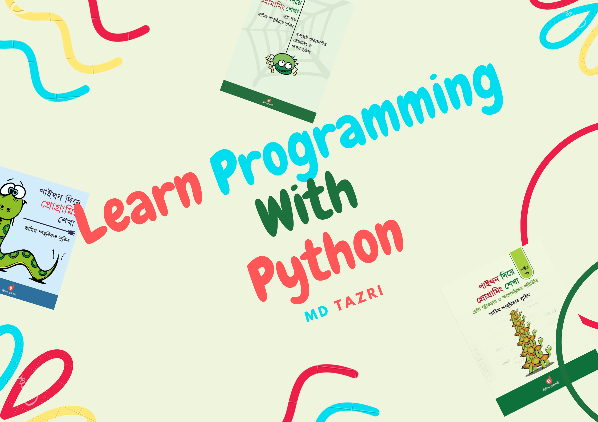

 

Learn Programming With Python 
=============================

This repository create for complate document on 3 part of "পাইথন দিয়ে প্রোগ্রামিং শিখা" books. I already complate this documentation 1 year ago. Just I upload it day by day. 

Here all part of this book : 
----------------------------

1. [Part 1: Basic Programming.](./part_1/part_1.md)
1. [Part 2: Object Oriented Programming.](./part_2/part_2.md)
1. [Part 3: Data Structure and Algorithm.](./part_3/part_3.md) not complete :(