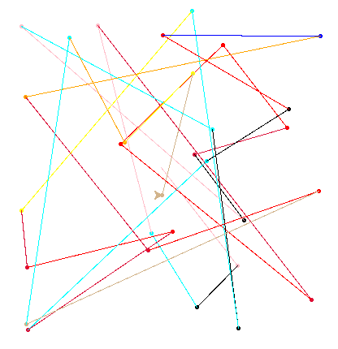
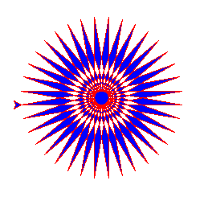

Chapter 10 : Some Fun Program
=============================

## **More Turtle**
Here explain more turtle method like **begin_fill**, **end_fill** and more about **color** :

### **begin_fill**
**turtle.begin_fill** it mark begin point and waiting for calling **turtle.end_fill** method.

### **end_fill**
**turtle.end_fill** finish the fill and color the colsed shape.

### **color**
Here syntax more about **turtle.color** :
```python
import turtle
turtle.color(stroke_color,fill_color);
``` 

<hr />

## **timeit**
**timeit** just a python default module which can use for figure out function efficient. simple use : 

```python
import timeit

def hi() :
    print("Hi, World!");

t = timeit.timeit(hi) # return the time need to hi function

print(t) 
```
<hr />

## **random**
**random** is default python module. Here simple syntax of method of random :

```python
import random

random.random() # return random number between 0 to 1. not including 1 and 0

random.randint(s,e) # return integer number between s and e including s and e.

```

<hr />

## Let's write some fun program :

**Random Function.**
```bash
>>> import random
>>> random.random()
0.1469881910994275
>>> random.random()
0.33355591923991057
>>> 
>>> random.randint(10,50)
38
>>> random.randint(10,50)
17
>>> random.randint(10,50)
22
>>> random.randint(10,50)
45
>>> 
```

**Turtle Position.**
```bash
>>> import turtle
>>> turtle.position()
(0.00,0.00)
>>> turtle.forward(100)
>>> turtle.position()
(100.00,0.00)
>>> turtle.left(90)
>>> turtle.position()
(100.00,0.00)
>>> turtle.forward(50)
>>> turtle.position()
(100.00,50.00)
>>> turtle.backward(200)
>>> turtle.position()
(100.00,-150.00)
>>> 
```

***Program : random_line.py***
```python
import turtle,random

color_list = [
    "red",
    "yellow",
    "black",
    "crimson",
    "blue",
    "cyan",
    "pink",
    "orange",
    "tan"   
]

for i in range(30) :
    color = color_list[random.randint(0,len(color_list) - 1)]; 
    x,y = random.randint(-200,200),random.randint(-200,200);

    turtle.color(color);
    turtle.setposition(x,y);
    turtle.dot();

turtle.done();
```

***Output : random_line.py***

;

***Program : random_dot.py***
```python
import turtle,random

color_list = [
    "red",
    "yellow",
    "black",
    "crimson",
    "blue",
    "cyan",
    "pink",
    "orange",
    "tan"   
]

turtle.penup()

for i in range(50) : 
    turtle.color(color_list[random.randint(0,len(color_list) - 1)]);
    x,y = random.randint(-150,150),random.randint(-150,150);
    turtle.setposition(x,y);
    turtle.dot();

turtle.exitonclick();
```

***Output : random_dot.py***


***Program : is_prime.py***
```python
def is_prime(n) : 
    if n == 1 : 
        return False;
    elif n == 2 : 
        return True
    elif n % 2 == 0 : 
        return False;
    else :
        rt_n = int(n**0.5);

        for i in range(3,rt_n+1,2) : 
            if not n % i :
                return False;
        
        return True;


while True :
    n = input("Please enter the number or 0 to exit : ");
    n = int(n);

    if not n : 
        print(">>> PROGRAM TERMINATE <<<");
        break;
    
    elif is_prime(n) :
        print(n,"is prime number.");
    else : 
        print(n,"is not prime number.");
```

***Output : is_prime.py***
```bash
Please enter the number or 0 to exit : 1
1 is not prime number.
Please enter the number or 0 to exit : 51
51 is not prime number.
Please enter the number or 0 to exit : 4
4 is not prime number.
Please enter the number or 0 to exit : 50
50 is not prime number.
Please enter the number or 0 to exit : 101
101 is prime number.
Please enter the number or 0 to exit : 0
>>> PROGRAM TERMINATE <<<
```

***Program : is_prime_timeit.py***
```python
import timeit

def is_prime(n = 51) : 
    if n == 1 : 
        return False;
    elif n == 2 : 
        return True
    elif n % 2 == 0 : 
        return False;
    else :
        rt_n = int(n**0.5);

        for i in range(3,rt_n+1,2) : 
            if not n % i :
                return False;
        
        return True;


t = timeit.timeit(is_prime);

print("Total time for timeit : ",t);
```

***Output : is_prime_timeit.py***
```bash
Total time for timeit :  0.7189457929998753
```

***Program : turtle_sun.py***
```python
import turtle

turtle.color("red",'blue')
turtle.begin_fill()

while True : 
    turtle.forward(200);
    turtle.left(170);

    if abs(turtle.position()) < 1 :
        break;

turtle.end_fill();
turtle.exitonclick();
```

***Output : turtle_sun.py***



***Program : fibonacci.py***
```python
def fibo(n) :
    if n <= 2 :
        return 1;
    else :
        past_n = 1;
        present_n = 1;

        for i in range(n-2) :
            tem_present_n = present_n;
            present_n = tem_present_n + past_n;
            past_n = tem_present_n;

        return present_n;


while True :
    n = input("Please Enter N or 0 to exit : ");
    n = int(n);

    if not n :
        print("\n>>> PROGRAM TERMINATE <<<");
        break;
    else :
        print(n,"th finbonacci number is : ",fibo(n));
```


***Output : fibonacci.py***
```bash
Please Enter N or 0 to exit : 3
3 th finbonacci number is :  2
Please Enter N or 0 to exit : 5
5 th finbonacci number is :  5
Please Enter N or 0 to exit : 7
7 th finbonacci number is :  13
Please Enter N or 0 to exit : 10
10 th finbonacci number is :  55
Please Enter N or 0 to exit : 0

>>> PROGRAM TERMINATE <<<
```