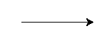
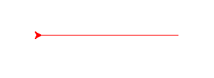
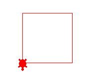
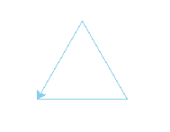
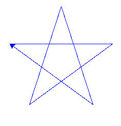
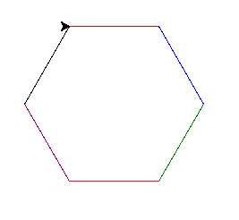

Chapter 5 : Introduce With Turtle
==================================

## **turtle**
**turtle** is python module which is use for create various type of shape like box, trangle, star ext. 

<hr>

## **turtle.color**
**turtle.color** use for change turtle line color. it support 3 type of argument. Here it is : 

```python
turtle.color('color_name_string');
turtle.color((r,g,b)); # tuple rgb form
turtle.color(r,g,b); # rgb color 3 different parameter
```

<hr>

## **turtle.speed**
**turtle.speed** to define the turtle speed to draw shape. It take number 0 to 10 as a argument. **0** is by default. **0** means here full speed and **1** is slower than **2**, **2** is faster than **1**, **3** is faster than **4**... at last **10** is faster than **9** but it slower than **0**.

<hr>

## **turtle.shape**
**turtle.shape** to define the shape of turtle. **6** type turtle shape available, and **turtle.shape** take it as a string. The shape is : 
1. arrow
1. turtle
1. circle
1. square
1. triangle
1. classic

<hr>

## **turtle.forward**
**turtle.forward** take a number to move forward how many pixel. 

<hr>

## **turtle.backward**
**turtle.backward** work like **turtle.forward** just take a number to how many pixel move backward.

<hr>

## **turtle.right**
**turtle.right** just take a number as degree of angle for how many angle turn around from right. 

<hr>

## **turtle.left**
**turtle.left** work like **turtle.right**. Just it turn around from left. 

<hr>

## **turtle.exitonclick**
**turtle.exitonclick** call it for not exit from turtle graphic until click on it. 


<hr>

Let's code a some program on turtle and see the output : 

***Program : basic_turtle.py***
```python
import turtle

turtle.forward(100);
turtle.exitonclick();
```

***Output : basic_turtle.py***




***Program : backward.py***
```python
import turtle

turtle.speed(1);
turtle.forward(100);
turtle.color("red");
turtle.backward(200);
turtle.exitonclick();
```

***Output : backward.py***



***Program : box.py***
```python
import turtle

# creating box by turtle
turtle.shape("turtle");
turtle.color("red");
turtle.forward(100);
turtle.left(90);
turtle.forward(100);
turtle.left(90);
turtle.forward(100);
turtle.left(90);
turtle.forward(100);
turtle.exitonclick();
```

***Output : box.py***



***Program : triangle.py***
```python
import turtle


turtle.color("skyblue")
turtle.forward(100);
turtle.left(120);
turtle.forward(100);
turtle.left(120);
turtle.forward(100);
turtle.exitonclick();
```

***Output : triangle.py***



***Program : star.py***
```python
import turtle

move = 200;
angle = 180 - 36;

turtle.speed(1);
turtle.color("blue");
turtle.forward(move);
turtle.right(angle);
turtle.forward(move);
turtle.right(angle);
turtle.forward(move);
turtle.right(angle);
turtle.forward(move);
turtle.right(angle);
turtle.forward(move);
turtle.exitonclick();
```

***Output : star.py***




***Program : hexa.py***
```python
import turtle

shapes = [
    'arrow',
    'turtle',
    'circle',
    'square',
    'triangle',
    'classic'
]

color = [
    'red',
    'blue',
    'green',
    'crimson',
    'purple',
    'black'
]


move = 100;
angle = 180 - 120;

turtle.speed(1);
for i in range(len(shapes)) : 
    turtle.shape(shapes[i]);
    turtle.color(color[i]);
    turtle.forward(move);
    turtle.right(angle);

turtle.exitonclick();
```

***Ouput : hexa.py***




[< Go Back](./../part_1.md)
---------------------------