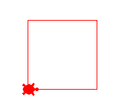
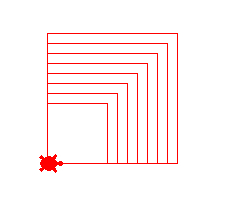
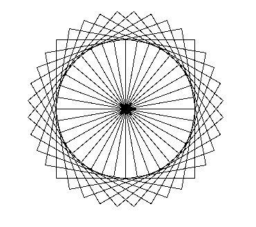
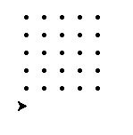

Chapter 6 : Loop - Do Same Task Multiple
========================================

## **More Turtle**
Here explain more turtle method like pendown, penup and dot.

### **pendown**
**turtle.pendown** method called for start to write to next move like **forward** and **backward**.

### **penup**
**turtle.backward** method called for end to write to next move like **forward** and **backward**.

<hr/>

## **for**
Simple syntax of for loop : 
```python 
for i in range(time) : 
    # statement gose here
    # every iterate i value will change

for i in "string" : 
    # statement gose here
    # every iterate i value change by latter of string.

for i in ['list'] : 
    # every iterate i value change by list element

for i in iterator_object : 
    # every iterate i value change by iterate element.
```

<hr/>

## **range**
**range** function return a iterable object. Here range syntax : 
```python
range(end);
# it return iterable object which is contain element from 0 to before end.

range(start,end);
# it return iterable object which is contain element from start to before end.

range(start,end.step);
#it return iterable object which is contain element from start to before end but it skip step time element between every two element after step.
```

<hr/>

## **list**
**list** is a function which can capable to change **range** object to **list** object.

<hr/> 


## **while**
**while** is loop which is use for loop some statement base on condition. Here structure of **while loop**

```python
while condition : 
    # statement gose here
```

<hr />


## **Assignment Operator**
**Assignment Operator** use for store value in variable. Here explain all assignment operator except =. 

| Operator | Explain     |
|----------|-------------|
| i+=n     | i = i + n   |
| i-=n     | i = i - n   |
| i*=n     | i = i * n   |
| i/=n     | i = i / n   |
| i%=n     | i = I % n   |
| i//=n    | i = i // n  |
| i**=n    | i = i ** n  |

<hr />


**Let's start program with while, and for loop :**

***Program : for.py***
```python
for i in range(10) : 
    print("I want to be a great programmer."); 
```

***Output : for.py***
```bash
I want to be a great programmer.
I want to be a great programmer.
I want to be a great programmer.
I want to be a great programmer.
I want to be a great programmer.
I want to be a great programmer.
I want to be a great programmer.
I want to be a great programmer.
I want to be a great programmer.
I want to be a great programmer.
```

***Simple for loop to print 0 to 4***
```bash
>>> for i in range(5) : 
...     print(i)
... 
0
1
2
3
4
```

***Program : square_loop.py***
```python
import turtle

move = 100;

turtle.shape("turtle");
turtle.color('red');
turtle.speed(1);

for i in range(4) : 
    turtle.forward(move);
    turtle.left(90);

turtle.exitonclick();
```

***Output : square_loop.py***




***Sum 1 to 50 times in result variable and print it***
```bash
>>> result = 0
>>> for i in range(50) : 
...     result = result + 1
... 
>>> print(result)
50
>>> 
```

***Print sum of first 50 numbers***
```bash
>>> result = 0
>>> for num in range(51) :
...     result = result + num
... 
>>> print(result)
1275
>>> 
```

***Print 1 to 20 different with 5 by for loop***
```bash
>>> for i in range(1,20,5) : 
...     print(i)
... 
1
6
11
16
>>> 
```

***Find biggest number in list***
```bash
>>> numbers = [6,1,3,0,9,3,2,5]
>>> max_n = numbers[0]
>>> for n in numbers : 
...     if n > max_n : 
...             max_n = n
... 
>>> max_n
9
>>> 
```

***Program : one_to_hundred.py***
```python
result = 0;

for num in range(101) : 
    if num % 5 == 0 : 
        print(num);
        result += num;
print("Sum is : ",result);
```

***Output : one_to_hundred.py***
```bash
........
........
........
80
85
90
95
100
Sum is :  1050
```

***Program : dash_line.py***
```python
import turtle

turtle.shape("turtle");
turtle.color("red");

for i in range(20) : 
    turtle.forward(10);
    turtle.penup();
    turtle.forward(3);
    turtle.pendown();

turtle.exitonclick();
```

***Output : dash_line.py***


***Program : square_in_square.py***
```python
import turtle

turtle.shape("turtle");
turtle.color("red");
turtle.speed(1);

for side_length in range(60,140,10) : 
    for i in range(4) : 
        turtle.forward(side_length);
        turtle.left(90);

turtle.exitonclick();
```

***Output : square_in_square.py***




***Create 0 to 10 list by range and list function***
```bash
>>> li = list(range(11))
>>> print(li)
[0, 1, 2, 3, 4, 5, 6, 7, 8, 9, 10]
>>> 
```

***Create even number list 1 to 20 by range and list function***
```bash
>>> li = list(range(2,21,2))
>>> print(li)
[2, 4, 6, 8, 10, 12, 14, 16, 18, 20]
>>> 
```

***Do something with while loop***
```bash
>>> i = 0;
>>> while i < 5 : 
...     print(i)
...     i += 1
... 
0
1
2
3
4
>>> i = 5
>>> while i >= 0 :
...     i -= 1
...     print(i)
... 
4
3
2
1
0
-1
>>> 
```

***Program : namta.py***
```python
n = input("Please enter a positive integer : ");
n = int(n);

m = 1;

while m <= 10 : 
    print(n,"X",m,"=",n*m);
    m += 1;
```

***Output : namta.py**
```bash
Please enter a positive integer : 5
5 X 1 = 5
5 X 2 = 10
5 X 3 = 15
5 X 4 = 20
5 X 5 = 25
5 X 6 = 30
5 X 7 = 35
5 X 8 = 40
5 X 9 = 45
5 X 10 = 50
```

***Program : wheel_of_box.py***
```python
import turtle

turtle.color("black");
turtle.shape("turtle");
turtle.speed(4);

counter = 0;
while counter < 36 : 
    for i in range(4) : 
        turtle.forward(100);
        turtle.right(90);
    turtle.right(10);
    counter += 1;

turtle.exitonclick();
```

***Output : wheel_of_box.py***



***Program : dot_of_box***
```python
import turtle

height = 5;
width = 5;

turtle.penup();

for y in range(height) : 
    for x in range(width) : 
        turtle.dot();
        turtle.forward(20);
    
    turtle.backward(20*width);
    turtle.right(90);
    turtle.forward(20);
    turtle.left(90);

turtle.exitonclick();
```

***Output : dot_of_box***




***Program : break_continue.py***
```python
while True : 
    n = input("Please enter a number : ");
    n = int(n);

    if n < 0 : 
        print("We only allow positive number. Please try again.");
        continue;

    if not n : break;

    print("Square of",n,"is",n*n);

```

***Output : break_continue.py***
```bash
Please enter a number : 4
Square of 4 is 16
Please enter a number : 2
Square of 2 is 4
Please enter a number : -4
We only allow positive number. Please try again.
Please enter a number : 8
Square of 8 is 64
Please enter a number : -7
We only allow positive number. Please try again.
Please enter a number : 0
```

***Program : last_program.py***
```python
terminate = False;

while not terminate : 
    number_1 = int(input("Please Enter A Number : "));
    number_2 = int(input("Please Enter Another Number : "));

    while True : 
        operation = input("Please enter add/sub or quit to exit : ");
        
        # this for quit
        if operation == "quit" : 
            terminate = True;
            break;
        
        # this for others operation
        if operation not in ["add","sub"] : 
            print("Uknown operation!");
            continue;

        # this for add
        if operation == "add" : 
            print("Result is : ",number_1 + number_2);
            break;
        
        # this for sub 
        if operation == "sub" : 
            print("Result is : ",number_1 - number_2);
            break;
```

***Output : last_program.py***
```bash
Please Enter A Number : 10
Please Enter Another Number : 20
Please enter add/sub or quit to exit : add
Result is :  30
Please Enter A Number : 1 
Please Enter Another Number : 2
Please enter add/sub or quit to exit : d
Uknown operation!
Please enter add/sub or quit to exit : quit
```

[< Go Back](./../part_1.md)
---------------------------