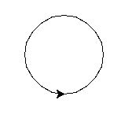
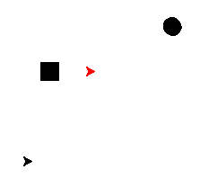

Chapter 3 : Object and Class
----------------------------

## **turtle**
Here we explain one more turtle method called **turtle.circle**. Syntax : 
```python
import turtle

turtle.circle(radius);

turtle.circle(radius,angle);
```

<hr />

## **class**
Here syntax of class 
```python
class Class_Name {
    attribute = value;
    attribute1 = value;
    ...................
    ...................
    def function() :
        # function defination

    def function_one(self) :
        # self is requirment at first parameter of function if call this function_one from object. self mean own object

        self.attribute_name
        # here access the own attribute by self object from function
    
    def __init__(self) :
        # here __init__ is construtor of class which is first called when creating object.

# we can access the attribute by class name
Class_Name.attribute
Class_Name.function() # here function self parameter is not requirment

# creating object
object_one = Class_Name(argument); # if argument exist then give them
object_one.attribute; # access the object attribute
object_one.function_one(argument) # here function self parameter is requirment;

# call the class function by object
Class_name.function_one(object_one);

}
```

<hr />
<br />
<br />

## Let's write some code with class.


**Create circle by turtle.**
```bash
>>> import turtle
>>> turtle.circle(50)
>>> turtle.done()
>>> 
```


**Create three turtle object by turtle.Turtle().**
```bash
>>> import turtle
>>> tom = turtle.Turtle()
>>> tom.color('red')
>>> tom.circle(100)
>>> type(tom)
<class 'turtle.Turtle'>
>>> 
>>> nonte = turtle.Turtle()
>>> fonte = turtle.Turtle()
>>> nonte.shape('circle')
>>> fonte.shape('square')
>>> nonte.left(30)
>>> nonte.forward(100)
>>> fonte.backward(50)
>>> monte= turtle.Turtle()
>>> monte.setpos(-100,-100)
>>> monte.forward(30)
>>> monte.clear()
>>> nonte.clear()
>>> fonte.clear()
>>> tom.clear
<bound method RawTurtle.clear of <turtle.Turtle object at 0x7fca74e77250>>
>>> tom.clear()
>>> 
```




**Type list.**
```bash
>>> type(li)
<class 'list'>
>>> dir(li)
['__add__', '__class__', '__class_getitem__', '__contains__', '__delattr__', '__delitem__', '__dir__', '__doc__', '__eq__', '__format__', '__ge__', '__getattribute__', '__getitem__', '__gt__', '__hash__', '__iadd__', '__imul__', '__init__', '__init_subclass__', '__iter__', '__le__', '__len__', '__lt__', '__mul__', '__ne__', '__new__', '__reduce__', '__reduce_ex__', '__repr__', '__reversed__', '__rmul__', '__setattr__', '__setitem__', '__sizeof__', '__str__', '__subclasshook__', 'append', 'clear', 'copy', 'count', 'extend', 'index', 'insert', 'pop', 'remove', 'reverse', 'sort']
>>> 
```

***Program : car.py***
```python
class Car :
    name = "Premio";
    color = "white";

    def start() :
        print(">>> Car Engine is Starting.. <<<");

print("Name of the car : ", Car.name);
print("Color : ", Car.color);

Car.start();
```

***Output : car.py***
```bash
$python3 car.py 
Name of the car :  Premio
Color :  white
>>> Car Engine is Starting.. <<<
```

***Program : another_car.py***
```python
class Car :
    name = "";
    color = "";

    def start() :
        print(">>> Car Engine is Starting.. <<<");


Car.name = "Axio";
Car.color = "Black";
print("Name of the car : ", Car.name);
print("Color : ", Car.color);

Car.start();
```

***Output : another_car.py***
```bash
Name of the car :  Axio
Color :  Black
>>> Car Engine is Starting.. 
```

***Program : my_car.py***
```python
class Car :
    name = "";
    color = "";

    def start(self) :
        print(">>> Car Engine is Starting.. <<<");


# creating a Car object
my_car = Car();
my_car.name = "ALlion";
print(my_car.name);
my_car.start();
```

***Output : my_car.py***
```bash
ALlion
>>> Car Engine is Starting.. <<<
```

***Program : car_init.py***
```python
class Car :
    def __init__(self,n,c) :
        self.name = n;
        self.color = c;
    

    def start(self) :
        print(">>> Car is Starting <<<");


my_car = Car("Corolla","White");
print(my_car.name);
print(my_car.color);
my_car.start();
```

***Output : car_init.py***
```bash
Corolla
White
>>> Car is Starting <<<
```

***Program : car_start_details.py***
```python
class Car :
    def __init__(self,n,c) :
        self.name = n;
        self.color = c;

    def start(self) :
        print("> name : ",self.name);
        print("> color : ",self.color);
        print("> Car is Starting <");

my_car = Car("Corolla","white");
my_car.start();
Car.start(my_car);

my_car.year = 2017;
print("my_car.year : ",my_car.year);
```

***Output : car_start_details.py***
```bash
$python3 car_start_detail.py 
> name :  Corolla
> color :  white
> Car is Starting <
> name :  Corolla
> color :  white
> Car is Starting <
my_car.year :  2017
```

[< Go Back](./../part_2.md)
---------------------------