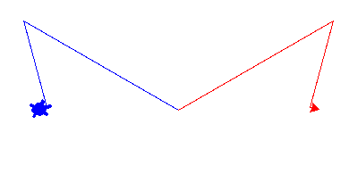

Chapter 6 : Inheritance 
=======================

## **Inheritance**
Learn about **inheritance** with syntax :

```python
class Base_Cass :
    def __init__(self) : 
        # base class constructor

    def base_class_function(self) :
        # statement here

# Derived_Class inherit the base class 
class Derived_Class(Base_Cass) :
    def __init__(self) :
        # derived class constructor
        super() # return base class of this class
        super().__init__() # base class contructor

    def base_class_function(self) :
        # this function will override the base class function
        super() # return base class

```

<hr />
<br>

## Let's write some program whith inheritance : 

***Program : vehicle.py***
```python
class Vehicle :
    """Base class for all vehicles"""
    def __init__(self,name,manufacturer,color) :
        self.name = name;
        self.manufacturer = manufacturer;
        self.color = color ;
    
    def drive(self) :
        print("Driving",self.manufacturer,self.name);

    def turn(self,direction) :
        print("Turning ",self.name,"to",direction);

    def brake(self) :
        print(self.name,"is stopping!");


if __name__ == "__main__" :
    v1 = Vehicle("Fusion 110 Ex","Walton","Black");
    v2 = Vehicle("Softail Delux","Harley_Davidson","Blue");
    v3 = Vehicle("Mustang 5.0 GT Coupe","Ford","Red");

    v1.drive();
    v2.drive();
    v3.drive();

    v1.turn("left");
    v2.turn("right");

    v1.brake();
    v2.brake();
    v3.brake();
```

***Output : vehicle.py***
```bash
$python3 vehicle.py 
Driving Walton Fusion 110 Ex
Driving Harley_Davidson Softail Delux
Driving Ford Mustang 5.0 GT Coupe
Turning  Fusion 110 Ex to left
Turning  Softail Delux to right
Fusion 110 Ex is stopping!
Softail Delux is stopping!
Mustang 5.0 GT Coupe is stopping!
```

***Program : car.py***
```python
import vehicle

# Car inherit the Vehicle class
class Car(vehicle.Vehicle) : 
    """Car class"""

    def change_gear(self,gear_name):
        print(self.name,"is changing gear to ",gear_name);


if __name__ == "__main__" :
    c = Car("Mustang 5.0 Gt Coupe","Ford","Red");
    c.drive();
    c.brake();
    c.change_gear("P");
```

***Output : car.py***
```bash
Driving Ford Mustang 5.0 Gt Coupe
Mustang 5.0 Gt Coupe is stopping!
Mustang 5.0 Gt Coupe is changing gear to  P
```

**About object class.**
```bash
>>> ob = object()
>>> type(ob)
<class 'object'>
>>> 
```

***Program : ./class/car.py***
```python
from vehicle import Vehicle

class Car(Vehicle):
    # Car class
    def __init__(self,name,manufacturer,color,year) :
        super().__init__(name,manufacturer,color);
        self.year = 2017;
        self.wheels = 4;
        print("A new has been created. Name : ",self.name);
        print("It has",self.wheels,"wheels");

    def change_gear(self,gear_name) :
        print(self.name,"is changing gear to",gear_name);

    def turn(self,direction) :
        print(self.name,"car is turning",direction)

if __name__ == "__main__" :
    c = Car("Mustang 5.0 GT Coupe","Ford","Red",2017);
    v = Vehicle("Softail Delux","Harley-Davidson","Blue");

    c.turn('right');
    v.turn('right');
```

***Output : ./class/car.py***
```bash
$python3 class/car.py 
Creating a vehicle
A new has been created. Name :  Mustang 5.0 GT Coupe
It has 4 wheels
Creating a vehicle
Mustang 5.0 GT Coupe car is turning right
Turning Softail Delux to right
```

***Program : ajobturtle.py***
```python
import turtle

class Ajobturtle(turtle.Turtle) :
    def forward(self,pixel) :
        super().backward(pixel);

    def backward(self,pixel) :
        super().forward(pixel);

    def left(self,angle) :
        super().right(angle);

    def right(self,angle) :
        super().left(angle);


if __name__ == "__main__" :
    montu = Ajobturtle();
    jhontu = turtle.Turtle();

    montu.color('blue');
    jhontu.color('red');

    montu.shape("turtle");
    jhontu.shape("classic");

    montu.left(30);
    jhontu.left(30);

    montu.forward(200);
    jhontu.forward(200);
    
    montu.left(45);
    jhontu.left(45);

    montu.backward(100);
    jhontu.backward(100);

    montu.right(90);
    jhontu.right(90);

    montu.forward(10);
    jhontu.forward(10);

    
    turtle.done();
```

***Output : ajobturtle.py***




[< Go Back](./../part_2.md)
---------------------------