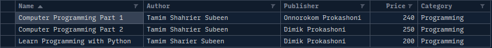
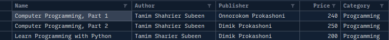

Chapter 8 : Web Crawling
========================

## CSV -> Comma Separated Values
Here explain some **csv** module function : 
```python
import csv # import csv module

# first open the any csv file
with open("file.csv","w") as  file : 
    # create csv file writer
    
    csv_writer = csv.writer(file,delimiter=",",quotechar"\"",quoting=csv.QUOTE_MINIMAL)

    # not necessary to pass delimiter, quotechar and quoting, it take it above value by default.
    csv_writer = csv.writer(file);

    # write single row
    csv_writer.writerow(['value1','value2','value3','value4'])


# open th file again
with open("file.csv","w") as file :
    # create csv dict writer : 
    csv_writter = csv.DictWriter(file,fieldnames=[name_1,name_2,name3,'...']);
    csv_writter.writeheader();
    csv_writter.writerow(single_row);
    csv_writter.writerows(row_list);

```

<hr />
<br />

## logging 
Here explain some **logging** module function :  

In python, 5 type of logging exist : 

1. debug
1. info
1. warning
1. error 
1. critical

Here syntax : 

```python
import logging

# basic logging config
logging.basicConfig(filename="file.log",filemode="w",level=logging.INFO)

# write logging
logging.debug('this is debug'); # it can not be logged because the log level is INFO
logging.info("This is info log"); # info logged it will write in file.

# logging format
logging.basicConfig(format='format gose here');
```

<hr />
<br />
<br />

## Let write some code with csv and logging module : 
------------------------------------

**Get information from books.toscrape.com and precess.**
```bash
>>> import requests
>>> import re
>>> url = 'http://books.toscrape.com/index.html'
>>> response = requests.get(url)
>>> response.ok
True
>>> text = response.text
>>> len(text)
51294
>>> result = re.findall(r'<div class="side_categories">(.*?)</div>',text,re.M|re.DOTALL)
>>> len(result)
1
>>> type(result)
<class 'list'>
>>> result
['\n            <ul class="nav nav-list">\n  .............]
```

**Next to above process :**
```bash
>>> new_text = re.findall(r'<div class="side_categories">(.*?)</div>',text,re.M|re.DOTALL)
>>> new_text = new_text[0]
>>> new_text
'\n            ..........
.....
>>> category_pat = re.compile(r'<li>\s*<a href="(.*?)">\s*(\w+[\s\w]+\w)\s*?<',re.M|re.DOTALL)
>>> result = re.findall(category_pat,new_text)
>>> result[0]
('catalogue/category/books_1/index.html', 'Books')
>>> len(result)
51
>>> for item in result :
...     print(item)
... 
('catalogue/category/books_1/index.html', 'Books')
('catalogue/category/books/travel_2/index.html', 'Travel')
.....................................
```

**Find book and url.**
```bash
>>> 
>>> url = "http://books.toscrape.com/catalogue/category/books/mystery_3/index.html"
>>> resp = requests.get(url)
>>> text = resp.text
>>> text = text.replace('\n'," ")
>>> book_pat = re.compile(r'<h3><a href="(.*?)" title="(.*?)"')
>>> 
>>> result = re.findall(book_pat,text)
>>> len(result)
20
>>> result[0]
('../../../sharp-objects_997/index.html', 'Sharp Objects')
>>> result[1]
('../../../in-a-dark-dark-wood_963/index.html', 'In a Dark, Dark Wood')
>>> 
```

**Is next page exist?**
```python
>>> next_page = re.findall(r'<li class="next"><a href="(.*?)">next</a></li>',text)
>>> next_page
['page-2.html']
>>> next_page[0]
'page-2.html'
>>> 
```

**Creating Page Two.**
```bash
>>> url = "http://books.toscrape.com/catalogue/category/books/mystery_3/index.html"
>>> i = url.rfind("/")
>>> i
60
>>> url[0:i]
'http://books.toscrape.com/catalogue/category/books/mystery_3'
>>> url[0:i+1]
'http://books.toscrape.com/catalogue/category/books/mystery_3/'
>>> url = url[0:i+1] + "page-2.html"
>>> url
'http://books.toscrape.com/catalogue/category/books/mystery_3/page-2.html'
>>> 
```

***Program : first_csv.py***
```python
import csv
import os

# create directory
try :
    os.mkdir("text");
except FileExistsError:
    print("May be directory already exist.");


# book details
field_names = ["Name","Author","Publisher","Price","Category"];
book1 = [
    "Computer Programming Part 1",
    "Tamim Shahrier Subeen",
    "Onnorokom Prokashoni",
    "240.00",
    "Programming"
];
book2 = [
    "Computer Programming Part 2",
    "Tamim Shahrier Subeen",
    "Dimik Prokashoni",
    "250.00",
    "Programming"
];
book3 = [
    "Learn Programming with Python",
    "Tamim Sharier Subeen",
    "Dimik Prokashoni",
    "200.00",
    "Programming"
]

book_list = [book1,book2,book3];


# create csv file
with open("./text/books.csv",'w') as file :
    csv_writer = csv.writer(file,delimiter=',',quotechar='\"',quoting=csv.QUOTE_MINIMAL);
    csv_writer.writerow(field_names);

    for book in book_list :
        csv_writer.writerow(book);

    print(">>> CSV FILE WRITE SUCCESSFULLY <<<");
    # csv_writer.writerows(book_list); # escape for loop to write row
```

***Output : first_csv.py***
```bash
$python3 first_csv.py 
May be directory already exist.
>>> CSV FILE WRITE SUCCESSFULLY <<<
```

***Output : first_csv.py to ./text/books.csv***
```csv
Name,Author,Publisher,Price,Category
Computer Programming Part 1,Tamim Shahrier Subeen,Onnorokom Prokashoni,240.00,Programming
Computer Programming Part 2,Tamim Shahrier Subeen,Dimik Prokashoni,250.00,Programming
Learn Programming with Python,Tamim Sharier Subeen,Dimik Prokashoni,200.00,Programming
```

***Preview : ./text/books.csv**



***Program : secound_csv.py***
```python
import os,csv

try :
    os.mkdir("text");
except FileExistsError :
    print(">>> The Directory already exsit. <<<");

# book details
field_names = ["Name","Author","Publisher","Price","Category"];
book1 = {
    "Name" :"Computer Programming, Part 1",
    "Author" : "Tamim Shahrier Subeen",
    "Publisher" : "Onnorokom Prokashoni",
    "Price" : "240.00",
    "Category" : "Programming"
};
book2 = {
    "Name" : "Computer Programming, Part 2",
    "Author" : "Tamim Shahrier Subeen",
    "Publisher" : "Dimik Prokashoni",
    "Price" : "250.00",
    "Category" : "Programming"
};
book3 = {
    "Name" : "Learn Programming with Python",
    "Author" : "Tamim Sharier Subeen",
    "Publisher" : "Dimik Prokashoni",
    "Price" : "200.00",
    "Category" : "Programming"
}

book_list = [book1,book2,book3];


file_name = './text/books_list.csv';

with open(file_name,'w') as csv_file :
    csv_writer = csv.DictWriter(csv_file,fieldnames=field_names);
    csv_writer.writeheader();
    csv_writer.writerows(book_list);
    print(">>> File was successfully created. <<<");
```

***Output : secound_csv.py***
```bash
$python3 secound_csv.py 
>>> The Directory already exsit. <<<
>>> File was successfully created. <<
```

***Output : secound_csv.py to ./text/books_list.csv***
```csv
Name,Author,Publisher,Price,Category
"Computer Programming, Part 1",Tamim Shahrier Subeen,Onnorokom Prokashoni,240.00,Programming
"Computer Programming, Part 2",Tamim Shahrier Subeen,Dimik Prokashoni,250.00,Programming
Learn Programming with Python,Tamim Sharier Subeen,Dimik Prokashoni,200.00,Programming
```

***Preview : ./text/book_list.csv***



***Program : read_csv.py***
```python
import csv

with open('./text/books.csv','r',newline='') as file :
    csv_reader = csv.reader(file);
    for row in csv_reader :
        print(row);
```

***Output : read_csv.py***
```bash
$ python3 read_csv.py 
['Name', 'Author', 'Publisher', 'Price', 'Category']
['Computer Programming Part 1', 'Tamim Shahrier Subeen', 'Onnorokom Prokashoni', '240.00', 'Programming']
['Computer Programming Part 2', 'Tamim Shahrier Subeen', 'Dimik Prokashoni', '250.00', 'Programming']
['Learn Programming with Python', 'Tamim Sharier Subeen', 'Dimik Prokashoni', '200.00', 'Programming']
```

***Program : first_logging.py***
```python
import logging,os

try :
    os.mkdir('log');
except FileExistsError :
    print(">>> Directory Already Exist <<<");

logging.basicConfig(filename='./log/test.log',level=logging.DEBUG);

logging.debug("This is debug log");
logging.info("This is info log");
logging.warning("This is warning log");
logging.error("This is error log");
logging.critical("This is critical log");
```

***Output : first_logging.py***
```bash
$python3 first_logging.py 
>>> Directory Already Exist <<<
```

***Output : first_logging.py to ./log/text.log***
```log
DEBUG:root:This is debug log
INFO:root:This is info log
WARNING:root:This is warning log
ERROR:root:This is error log
CRITICAL:root:This is critical log
```

***Program : secound_logging.py***
```python
import logging,os

# create log and date format
log_format = '%(asctime)s %(message)s';
date_format = '%m/%d/%Y %I:%M:%S %p';

# configure logging
logging.basicConfig(format=log_format,datefmt=date_format);


# logging
logging.debug("This is debug log");
logging.info("This is info log");
logging.warning("This is warning log");
logging.error("This is error log");
```

***Output : secound_logging.py***
```bash
$python3 secound_logging.py 
07/05/2022 04:57:56 AM This is warning log
07/05/2022 04:57:56 AM This is error log
```

***Program : web_crawling.py***
[web_crawling ->](./web_crawling.py)

<hr />

[< Go Back](./../part_2.md)
---------------------------