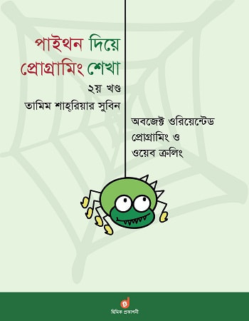

 

Learn Programming by Python 2nd Part, Tamim Shahriar Subeen
==================================================

This is the note of Secound part of **Tamim Shahriar Subeen** books on python. Where discuss about basic programming. Here I compete all the book and documented it here. Also I code every single of code in the book. 

Table of Index
---------------

1. [Chapter 1 : More Python](./chapter_1/chapter_1.md)
1. [Chapter 2 : Module and Package](./chapter_2/chapter_2.md)
1. [Chapter 3 : Object and Class](./chapter_3/chapter_3.md)
1. [Chapter 4 : Request Module and Creating File](./chapter_4/chapter_4.md)
1. [Chapter 5 : More Task With File and Exception](./chapter_5/chapter_5.md)
1. [Chapter 6 : Inheritance](./chapter_6/chapter_6.md)
1. [Chapter 7 : Regular Expression](./chapter_7/chapter_7.md)
1. [Chapter 8 : Web Crawling](./chapter_8/chapter_8.md)

[< Go Back README.md File](./../README.md)
------------------------------------------