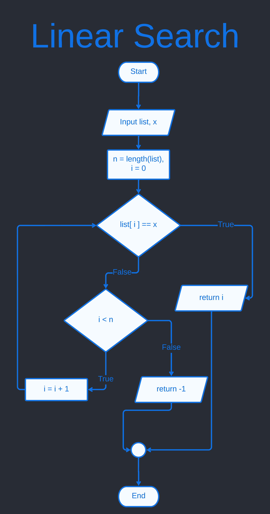
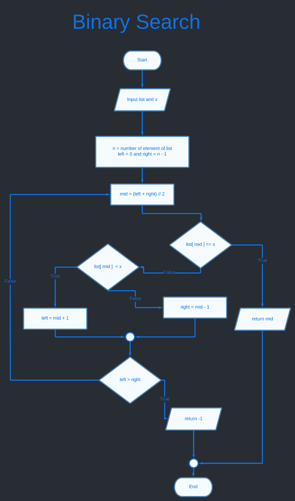

Chapter 4 : Searching Algorithm
===============================

## Linear Search 
### **Here linear search algorithm :**
1. Input a list and value x. 
1. index number i = 0.
1. total element of list is n. 
1. if list[i] == x, then go 9 otherwise next.
1. if i < n, then go 7 otherwise next.
1. if not i < n, then go 8.
1. i = i + 1, and go back 4.
1. not found return -1.
1. founded, return i.

### **Here simple linear search flowchart :**


### **Implement Linear Search Algorithm in Python :**
```python
def linear_search(li,x):
    # store length in n
    n = len(li);
    i = 0;

    while i < n : 
        if li[i] == x :
            return i;
        
        i = i + 1; 
    
    return -1;


if __name__ == "__main__" : 
    print('linear_search([3,5,6],5) : ',linear_search([3,5,6],5));
    print('linear_search([3,5],3) : ',linear_search([3,5],3));
    print('linear_search([3,5,8,7,5,1,6],1) : ',linear_search([3,5,8,7,5,1,6],1));
    print('linear_search([2,5,6,2],1) : ',linear_search([2,5,6,2],1));
    print('linear_search([],0) : ',linear_search([],0));
    
```

### ***Simple Test Output :***
```bash
$python linear_search.py 
('linear_search([3,5,6],5) : ', 1)
('linear_search([3,5],3) : ', 0)
('linear_search([3,5,8,7,5,1,6],1) : ', 5)
('linear_search([2,5,6,2],1) : ', -1)
('linear_search([],0) : ', -1)
```

### ***Driven Table Test :***
```python
def test_linear_search() : 
    test_cases = [
        {
            "name" : "simple case 0",
            "input" : [[3,5,6],5],
            "expected" : 1
        },
        {
            "name" : "simple case 1",
            "input" : [[3,5],3],
            "expected" : 0
        },
        {
            "name" : "simple case 2",
            "input" : [[3,5,8,7,5,1,6],1],
            "expected" : 5
        },
        {
            "name" : "simple case 3",
            "input" : [[2,5,6,2],1],
            "expected" : -1
        },
        {
            "name" : "simple case 4",
            "input" : [[],0],
            "expected" : -1
        }
    ]
```

```bash
$pytest linear_search.py 
============================= test session starts ==============================
platform linux -- Python 3.9.2, pytest-7.1.2, pluggy-1.0.0
rootdir: /home/tazri/Documents/work-place/python/learn-programming-with-python/part_3/chapter_4
collected 1 item                                                               

linear_search.py .                                                       [100%]

============================== 1 passed in 0.01s ===============================
```

***Time and Space Complexity :***
```python
def linear_search(li,x):
    # store length in n
    n = len(li); # O(1)
    i = 0; # O(1)

    while i < n : # n'th iterate
        if li[i] == x : # O(n)
            return i; # O(1)
        
        i = i + 1;  # O(n)
    
    return -1; # O(1)

'''
Calculate Time Complexity :  O(1) + O(1) + O(n) + O(1) + O(n) + O(1)
                           = 4 * O(1) + 2 * O(n)
                           = O(n)

Calculate Space complexity : 
O(1) -> for n variable
O(1) -> for i variable
total space complexity : O(1) + O(1)
                       = 2 * O(1)
                       = O(1)

Time Complexity : O(n)
Space Complexity : O(1)
'''
```

## Binary Search 

**Binary Search Algorithm :**

input : sorted list and x which is searching in list.
output : index mid where found the x otherwise -1.

1. n = number of element in list
1. left = 0 and right = n -1 
1. mid = (left+right) // 2
1. list[mid] == x, then go 9 otherwise next 
1. list[mid] < x, then left = mid + 1 and go 7 otherwise next
1. list[mid] > x, right = mid - 1 and go 7 otherwise next 
1. left > right, then go 8 otherwise go 3.
1. return -1. can not found x.
1. return mid, x founded at mid.

**Flowchart Binary Search Algorithm :**


**Implement Binary Search :**
```python
def binary_search(list,x) :
    left = 0;
    right = len(list) - 1;

    while left <= right :
        mid = (left + right) // 2;

        if list[mid] == x : 
            return mid;
        elif list[mid] < x :
            left = mid + 1;
        else :
            right = mid - 1;

    return -1

if __name__ == '__main__' : 
    print("binary_search([11,15,21,23,24,26,27],26) : ",binary_search([11,15,21,23,24,26,27],26));
    print("binary_search([15,18,19,21,22],21) : ",binary_search([15,18,19,21,22],21));
    print("binary_search([23,34,37,38],35) : ",binary_search([23,34,37,38],35));
```

***Ouput: binary_search.py***
```bash
$python3 binary_search.py 
binary_search([11,15,21,23,24,26,27],26) :  5
binary_search([15,18,19,21,22],21) :  3
binary_search([23,34,37,38],35) :  -1
```

***PyTest Binary Search.***
```python
def test_binary_search() :
    # run pytest binary_search.py

    test_case = [
        {
            'name' : 'simple case 0',
            'input' : [[2,4,5,7,8,9,12,17,21],12],
            'expected' : 6
        },
        {
            'name' : 'simple case 1',
            'input' : [[1,2,3,4,5],4],
            'expected' : 3
        },
        {
            'name' : 'simple case 2',
            'input' : [[33,36,41,52],45],
            'expected' : -1
        },
        {
            'name' : 'simple case 3',
            'input' : [[15,18,19,21,22],21],
            'expected' : 3
        },
        {
            'name' : 'simple case 4',
            'input' : [[11,15,21,23,24,26,27],26],
            'expected' : 5
        },
        {
            'name' : 'simple case 5',
            'input' : [[23,34,37,38],35],
            'expected' : -1
        }
    ]


    for case in test_case :
        test_name = case['name'];
        input_list = case['input'];

        assert case['expected'] == binary_search(input_list[0],input_list[1]), test_name
```

***Pytest Output binary_search.py***
```bash
$pytest binary_search.py 
====================================== test session starts ======================================
platform linux -- Python 3.9.2, pytest-7.1.2, pluggy-1.0.0
rootdir: /home/tazri/Documents/work-place/python/learn-programming-with-python/part_3/chapter_4
collected 1 item                                                                                

binary_search.py .                                                                        [100%]

======================================= 1 passed in 0.01s =======================================
```

***binary search space and time complexity :***
```python
def binary_search(list,x) :
    left = 0; # O(1)
    right = len(list) - 1; # O(1)

    while left <= right : # O(log n)
        mid = (left + right) // 2; # O(log n)

        if list[mid] == x : # O(log n)
            return mid; # O(log n)
        elif list[mid] < x : # O(log n)
            left = mid + 1; # O(log n)
        else : # O(log n)
            right = mid - 1; # O(log n)

    return -1 # O(1)

'''
calculate time complexity : O(1) + O(1) + 7 * O(log n) + O(1)
                          = 3 * O(1) + 7 * O(log n)
                          = O(log n)

calculate space complexity : 
O(1) -> for left variable
O(1) -> for right variable
O(1) -> for mid variable
total space complexity : 3 * O(1)
                       = O(1)

time complexity : O(log n)
space complexity : O(1)

'''
```

<hr /> 
<br /> 

[< Go Back](./../part_3.md)
---------------------------