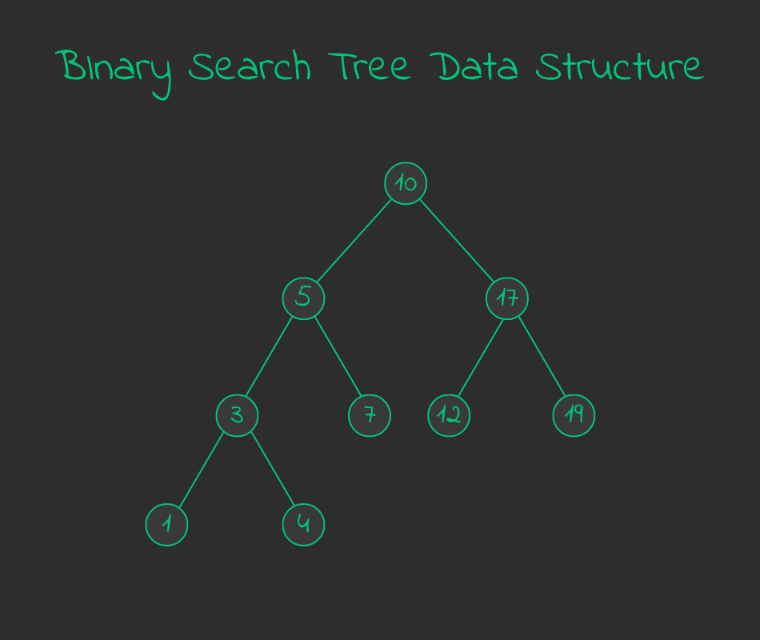
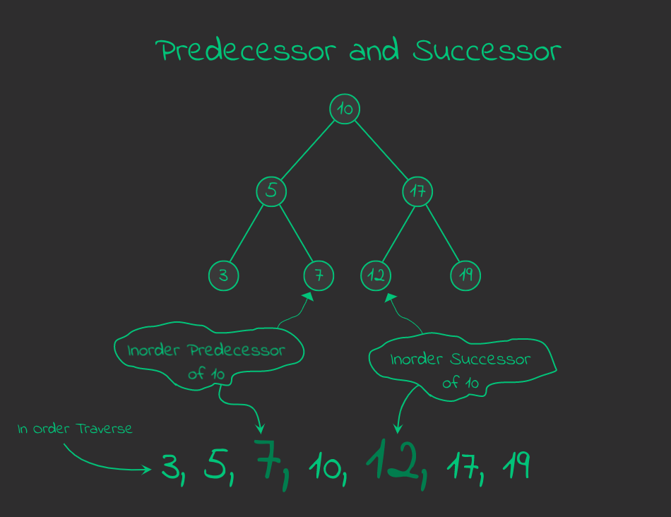
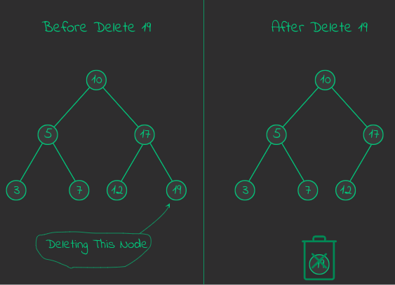
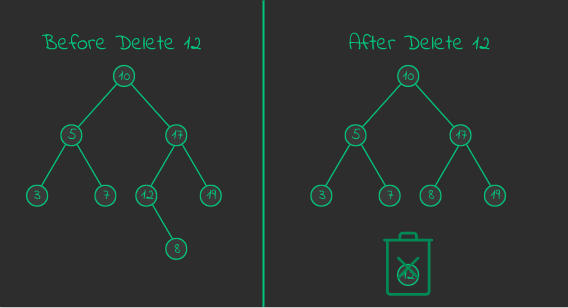
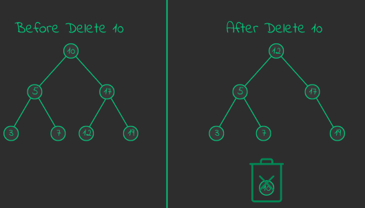

Chapter 10 : Binary Search Tree
===============================
Binary Search Tree is a kind of tree which left child is smaller than root and right child greater than root. Here simple example : 




## Point of Binary Search Tree
- Every left child is smaller than root.
- Every right child is greater than root.
- Every child of right child must be greater than root.
- Every child of left child must be smaller than root.
- In order traverse of Binary Search Tree Then it produce sorted item. 

## Inorder Predecessor and Successor
When traverse the binary search tree and this time every given node's neighbors called **predecessor** and **successor**. The node behind the given node called **predecessor** and the node ahead the given node called **successor**. Here example : 




## How to insert a node in binary search tree. 
Here algorithm for insert a node in binary search tree :

input : root, node 
1. if root is empty then set node as root. and go 4
1. if node is smaller then root then check left. if left child is empty then insert it and go 4 left other wise traverse left and go back 2.
1. if node is greater then root then check right. if right child is empty then insert it and go 4 other wise traverse right node and go back 2.
1. return the root.

***Insert a node in binary search tree : insert_bst***
```python
# insert node as binary search tree
def insert_bst(root,node) :
    last_root = None;
    current_root = root;

    # traverse the root until find a place
    while current_root :
        last_root = current_root;

        # if node < root
        if current_root.data > node.data :
            current_root = current_root.left;

        # if node > root
        elif current_root.data < node.data :
            current_root = current_root.right;

        # if node == root
        else :
            return False;

    if node.data < last_root.data :
        last_root.add_left(node);
    elif node.data > last_root.data :
        last_root.add_right(node);
    else : 
        root == last_root;

    return root;
```
---------------------------------------------
<br />

### How to find minimum node in binary search tree ?
Minimum node of binary search tree is last node of left child. Traverse the left child again and again until reach the last level of tree then we can find the minimum node of binary tree.

> Traverse the left of binary tree until reach a node which left node is empty. This node is minimum node of binary search tree.

***Find minimum in binary search tree: bst_minimum***
```python
# minimum
def bst_minimun(_root:Binary_Tree.Node)->Binary_Tree.Node:
    left = _root;

    while left.left : left = left.left;

    return left;
```

### How to find maximum node in binary search tree. 
Maximum node of binary search tree is last node of right child. Traverse the right child again and again until reach the last level of tree then we can found the maximum node of binary tree.

> Traverse the right of binary tree until reach a node which right node is empty. This node is maximum node of binary search tree.

***Find maximum in binary search tree: bst_maximum***
```python
# maximum
# maximum
def bst_maximum(_root:Binary_Tree.Node)->Binary_Tree.Node:
    right = _root;

    while right.right : right = right.right;

    return right;
```

### How ot find inorder predesecor and successor
Successor of any node of binary search tree is manimum of it's right sub tree. Predesecor is maximum node of it's left sub tree.

-----------------------------------------

## Delete node in binary search tree.
When We delete node in binary search tree then 3 thing occur :

1. Delete a node which has no child.
1. Delete a node which has one child. 
1. Dlete a node which has two child.


### Delete a node which has no child.
In that case just delete reference it from it parent. Nothing else. Here visualization : 



### Delete a node which has one child
In that case just delete the node and conect it's child to it's parent. Here example : 



### Delete a node which has two child
In that case delete replace node with it inorder predecessor or successor and delete successor or predecessor. If successor or predecessor has child then connect it with successor or predecessor parent.



***Delete node from bst : bst_delete*** 
```python
# transplant
def bst_transplant(_root:Binary_Tree.Node,_current_node:Binary_Tree.Node,_new_node:Binary_Tree.Node):
    if _current_node.parent == None :
        _root = _new_node;
    elif _current_node == _current_node.parent.left :
        _current_node.parent.add_left(_new_node);
    else :
        _current_node.parent.add_right(_new_node);
    
    return _root;

# delete
def bst_delete(_root:Binary_Tree.Node,_node:Binary_Tree.Node):
    # if left dose not exist or both dose not exist
    if _node.left == None :
        bst_transplant(_root,_node,_node.right);
        return _root;
    
    # if right dose not exist
    if _node.right == None:
        bst_transplant(_root,_node,_node.left);
        return _root;

    # if left and right both exist 
    # find the successor
    successor = bst_minimun(_node.right);

    # if node was parent
    if _node.parent == None :
        p_left = _root.left;
        p_right = _root.right;

        bst_transplant(_root,successor,successor.right);
        bst_transplant(_root,_node,successor);
        successor.add_left(p_left);
        successor.add_right(p_right);      
        return successor;

    # if node was not parent
    node_parent = _node.parent;
    n_left = _node.left;
    n_right = _node.right;
    bst_transplant(_root,successor,successor.right);
    bst_transplant(_root,_node,successor);
    successor.add_left(n_left);
    successor.add_right(n_right);
    successor.parent = node_parent;
    return _root;

```
----
<br />

[< Go Back](./../part_3.md)
---------------------------