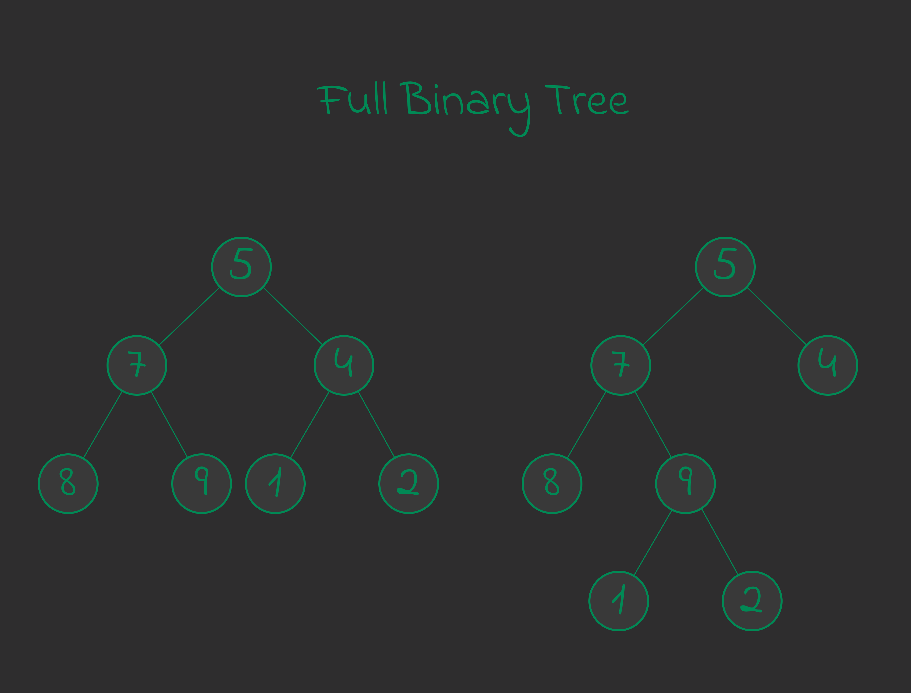
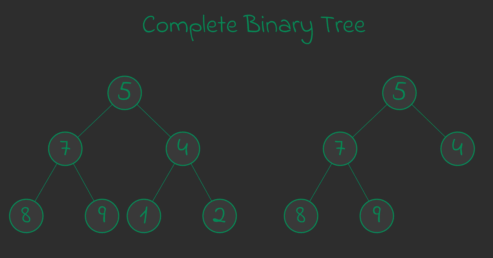
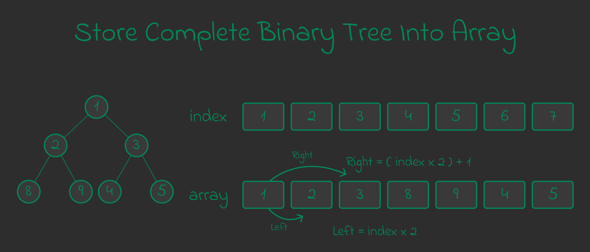
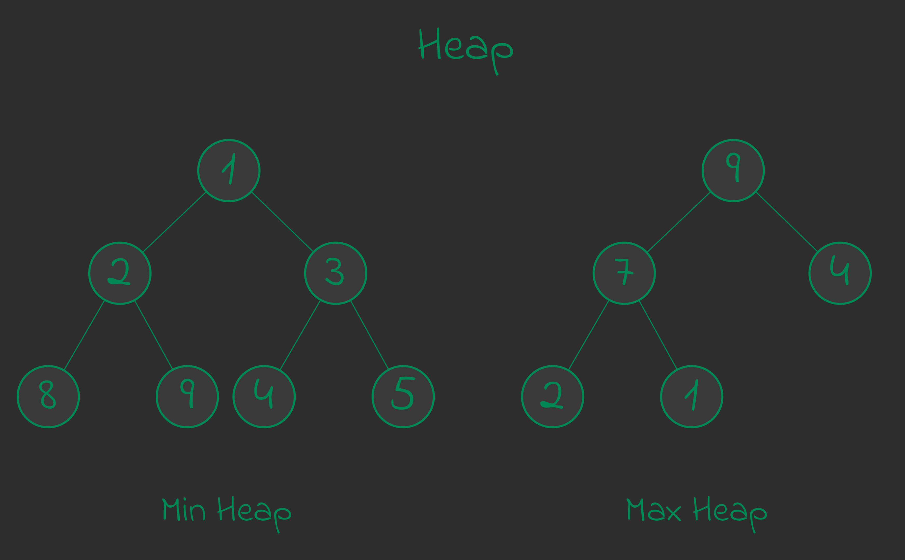
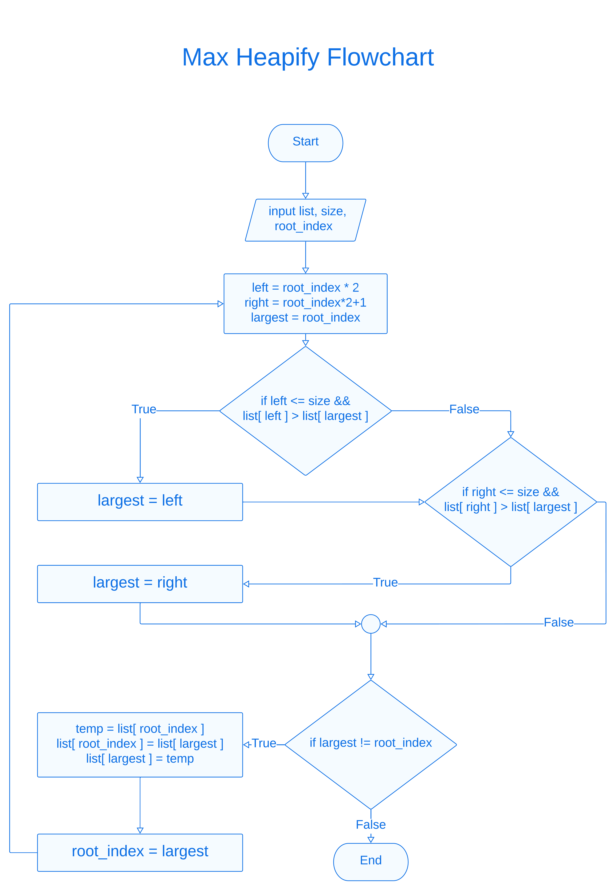

Chapter : Heap, Heap Sort and Priority Queue
============================================

Here discust about :
- Full and complete binary tree.
- Heap.
- Implement max heap and min heap.
- Implement heap sort.
- Implement Priority Queue.
<hr />

## Full and Complete Binary tree
***Full Binary Tree :*** Full binary tree is a kind of binary tree where every node has either two children or no children. Here example : 



***Complete Binary Tree :*** Complete binary tree is a tree which all level fill except last level, which filled from the left. Here example : 



We can store complete binary tree into array. In that case every node left child index is double of it's index and right child index is more than one of left child index.

```python
def left(n):
    return n*2;

def right(n):
    return (n*2) + 1;
```
Visual Example : 



<hr />
<br />

## Heap
Heap is one kind of complete data structure. Where value of root is less than or equal of children or greater than or equal of children. They are two type of heap.

1. Min heap. Here root are equal or smaller than children.
2. Max heap. Here root are equal or greater than childre.

Example : 




## How to check a list or a array is max heap or min heap ?

First Traverse the array from last with checking is node is bigger or smaller than parent. Here algorithm to check is a array or a list is max heap. 

0. input : list l 
1. traverse the array from last to secound first and do step two every traverse. if traverse is done then go 4.
2. array element n and index ni. check n > l[ni//2] or check n is smaller then parent. if it false then stop traversing do step 3.
3. return false. stop here.
4. return true. stop here.

Same with heap sort. just check is parent greater than from node or not. Here implementation : 

***Program : checking is heap or not :***
```python
# parent
def get_parent(_i)-> int : return _i // 2;

# is_max_heap
def is_max_heap(_heap):
    n = len(_heap) - 1;

    for i in range(n,1,-1):
        # check parent is less than child ??
        if _heap[get_parent(i)] < _heap[i] :
            return False;
    
    return True;

# is_min_heap
def is_min_heap(_heap):
    n = len(_heap) - 1;

    for i in range(n,1,-1):
        if _heap[get_parent(i)] > _heap[i] :
            return False;
    
    return True;

```

<hr />
<br />

## How to build a array to heap ?
Before learn how to build a array to heap, we need to learn how to build a single sub tree to heap. In that case first. The algorithm is : 

0. input a list l, size, and root_index
0. figure out bigger value index from first tree. the index is i.
0. i == root_index ? if false then go step 4.
0. swap root_index value with i and set root_index = i. Go to the step 1.
0. return the l. end here.

**Max Heapify Flowchart :**




Now next apply this max heapify algorithm on list from half of list index to first index. Here the algorithm : 

0. input a list l.
0. size of l is len(l) - 1;
0. traverse the list index from floor(size/2) to index 1 and apply the max heapify function for every traverse.

***Program : max_heap_build***
```py
# max_heapify
def max_heapify(_heap:list,_heap_size:int=None,_root:int=1)->list:
    heap_size =_heap_size or len(_heap)-1;
    left = get_left(_root);
    right = get_right(_root);

    # find largest value index between left, right and _root;
    if left <=heap_size and _heap[left] > _heap[_root]:
        largest = left;
    else:
        largest = _root;

    if right <= heap_size and _heap[right] > _heap[largest]:
        largest = right;
    
    # root is largest
    if largest == _root :
        return _heap;
    
    # if not root i largest
    swap(_heap,largest,_root); # swap first;
    max_heapify(_heap,_heap_size,largest);


# max_build
def max_heap_build(_list:list)->list:
    size = len(_list)-1;

    for i in range(size//2,0,-1):
        max_heapify(_list,size,i);

    return _list;

```

***Program : min_heap_build***
```py
# min_heapify
def min_heapify(_heap:list,_heap_size:int=None,_root:int=1)->list:
    heap_size = _heap_size or len(_heap_size) - 1;
    left = get_left(_root);
    right = get_right(_root);

    # find smallest value index between left, right and _root
    if left <= heap_size and _heap[left] < _heap[_root]:
        smallest = left;
    else:
        smallest = _root;
    
    if right <= heap_size and _heap[right] < _heap[smallest]:
        smallest = right;
    
    # if smallest is _root then finish it
    if smallest == _root:
        return _heap;
    
    # swap root with smallest
    swap(_heap,smallest,_root);
    min_heapify(_heap,_heap_size,smallest);


# min_heap_build
def min_heap_build(_list:list)->list:
    size = len(_list) - 1;

    for i in range(size//2,0,-1):
        min_heapify(_list,size,i);

    return _list;

```

<hr />
<br />

## Heap Sort
Here the heap sort algorithm : 

0. input : list.
0. size = length of list - 1.
0. make the list to max heap.
0. i = size.
0. swap value between list[i] and list[1].
0. max heapify with list, size and root as 1.
0. size = size - 1.
0. i = i - 1.
0. if i < 2 ? if true then go next other wise go 4.
0. return the list.
0. end.

Here can not explain max heapify and how to make list to max heap beacuse it already discuss above. 

***Program : heap_sort***
```py
get_parent = lambda _i : _i//2;
get_left = lambda _i : _i*2;
get_right = lambda _i : _i *2+1;
def swap(_list:list,_ai:int,_bi:int)->list:
    _list[_ai],_list[_bi] = _list[_bi],_list[_ai];
    return list;

# create max_heapify
def max_heapify(_heap:list,_heap_size:int=None,_root:int=1)->list:
    heap_size = _heap_size or len(_heap) - 1;
    rt = _root;
    left = get_left(rt);
    right = get_right(rt);

    # find largest value's index
    largest = rt;
    if left <= heap_size and _heap[left] > _heap[largest]:
        largest = left;
    
    if right <= heap_size and _heap[right] > _heap[largest]:
        largest = right;
    
    # if largest is rt
    if largest == rt :
        return _heap;

    # if largest is not rt
    swap(_heap,rt,largest); # swap value between largest and rt
    max_heapify(_heap,_heap_size,largest); # call it again for smallest value where placed

# build_max_heap
def build_max_heap(_heap:list)->list:
    size = len(_heap) - 1;

    for i in range(size//2,0,-1):
        max_heapify(_heap,size,i);

    return _heap;

# create heap heap sort
def heap_sort(_list:list)->list:
    size = len(_list) - 1;
    # build list to max_heap
    build_max_heap(_list);

    for i in range(size,1,-1):
        # swap with last index
        swap(_list,1,i);
        size -= 1;
        max_heapify(_list,size,1);

    return _list;
```
<hr />
<br />


## Priority Queue
A priority queue is special type of queue which element associated with a priority value. The value first out which priority high. However, if elements with the same priority occur, they are served according to their order in the queue. 

> A priority queue is a special type of queue in which each element is associated with a priority value. And, elements are served on the basis of their priority. That is, higher priority elements are served first.

***Operation of priority queue :***
### Insert Element
Inserting element in priority queue (max-heap) follow below algorithm : 

1. insert the element at the end of array.
1. compare it with parent. if it smaller than parent then do nothing. if not swap with parent.
1. Do the step 2 again again until parent is greater than insert element or reach the root.

### Delete Element
Here the algorithm for delete element from priority queue array : 

1. select the element.
1. swap the select element with last element of array or list.
1. remove the last element.
1. heapify the swaped element which is placed selected element index.

### Peeking Element.
In that case just return the first element of array without deleting. 

### Extract Element
First peeking the first element into another variable. and delete first element from priority queue. Return the peeking element at last.

***Here is implamentation of priority queue :***
```python
class Priority_Queue:
    pass;

class Priority_Queue: 
    # constructor
    def __init__(self,_list:list=None)-> None:
        if list == None:
            self.heap = [None];
        else :
            self.heap = [None] + _list;

            # build max heap
            self.build_max();
    
    # get maximum value
    def get_maximum(self)->int: return self.heap[1];

    # get_left_index
    def get_left_index(self,i:int)->int: return i*2;
    
    # get_left
    def get_left(self,i:int)->int : return self.heap[i*2]

    # get_right_index
    def get_right_index(self,i:int)->int : return i*2 + 1;

    # get_right 
    def get_right(self,i:int)-> int : return self.heap[i*2 + 1];

    # get_parent_index
    def get_parent_index(self,i:int)->int : return i//2;

    # get_parent
    def get_parent(self,i:int)->int: return self.heap[i//2];

    # get_value
    def get_value(self,i:int)->int : return self.heap[i];

    # swap
    def swap(self,ai:int,bi:int)->Priority_Queue:
        self.heap[ai],self.heap[bi] = self.heap[bi],self.heap[ai];
        return self;

    # max_heapify
    def max_heapify(self,heap:list,size:int=None,root_index:int=1)->Priority_Queue:
        size = size or len(heap) - 1;
        left_index = self.get_left_index(root_index);
        right_index = self.get_right_index(root_index);

        # find largest index
        largest = root_index;
        if left_index <= size and self.get_left(root_index) > self.get_value(root_index):
            largest = left_index;
        if right_index <= size and self.get_right(root_index) > self.get_value(largest):
            largest = right_index;

        # if largest value is root_index
        if largest == root_index : return self;

        # if largest is not root_index
        self.swap(largest,root_index); # swap value between largest and root_index
        self.max_heapify(self.heap,size,largest); # 

        # find 
        return self;

    # build_max
    def build_max(self)->list:
        size = len(self.heap) - 1;

        for i in range(size//2,0,-1):
            self.max_heapify(self.heap,size,i);

        return self.heap;

    # __repr__
    def __repr__(self) -> str:
        return str(self.heap);

    # show_tree
    def show_tree(self)->None:
        print(build(self.heap[1:]));

    # extract_max
    def extract_max(self)->int:
        if len(self.heap) <= 1 :
            print("-> Heap is totally empty :(");
            return 0;

        # replace the first with last
        popped = self.heap.pop();
        first = self.heap[1];

        self.heap[1] = popped;
        self.max_heapify(self.heap); # other is by default None and 1

        return first;

    # insert_node
    def insert_node(self,n:int)->Priority_Queue:
        self.heap.append(n);
        n_index = len(self.heap) - 1

        # bubble up for n right place
        while n_index > 1:
            parent = self.get_parent_index(n_index);

            if self.get_value(n_index) > self.get_parent(n_index):
                self.swap(n_index,parent);
                n_index = parent;
                continue;
            
            break;

        return self;

    # increase_key
    def change_key(self,i:int,new_value:int)->Priority_Queue:
        # first change the value from heap
        self.heap[i] = new_value;

        # if it bigger then parent
        if self.get_parent(i) != None and self.get_parent(i) < new_value:
            n_index = i;
            while n_index > 1:
                parent = self.get_parent_index(n_index);

                if self.get_value(n_index) > self.get_parent(n_index):
                    self.swap(n_index,parent);
                    n_index = parent;
                    continue;
                
                break;
            
            return self;
        
        # if by change child is small
        self.max_heapify(self.heap,len(self.heap)-1,i);

        return self;

```

<hr />
<br />

[< Go Back](./../part_3.md)
----------------------------