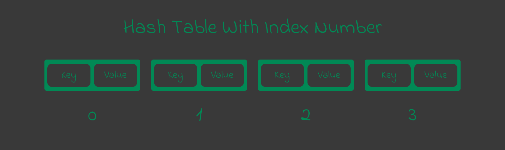
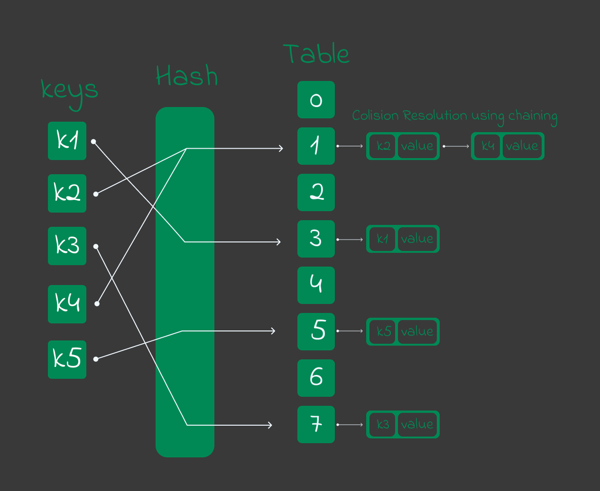
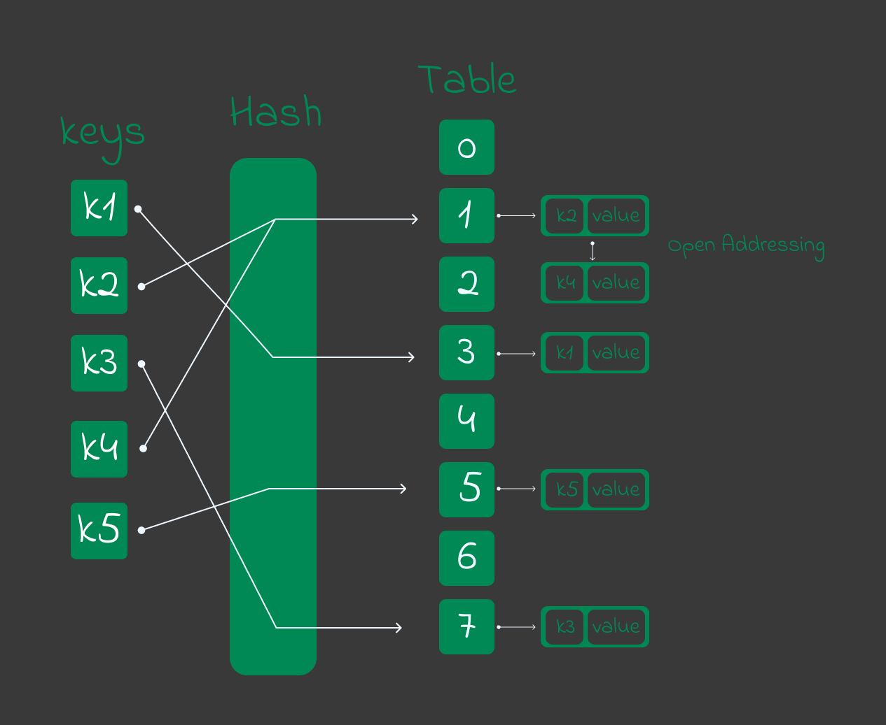

# Hash Table
Hash table is one kind of array where data store key and value pair. Here 3 importants part of hash table : 

- **Key** - key must be unique for using as indexing element.
- **Value** - value associated with keys.
- **Hash Function** - a spacify function which convert key to array index.



<hr />
<br />

## Hasing Function
In a hash table new index for new element generate by a function which take a key and create a positive intagare number for element index. This function called **hash function** and the process called **hashing**.

## Hash Collision
When the hash function generates the same index for multiple keys, it's called **Hash Collision**. Because in that case occur the conflict between two keys. What value store in same index. For this problem we using following techniques.

1. Collision Resolution by Chaining.
1. Open Addressing. 

### Collision Resolution by Chaining.
In this solution, if hash function produces the same index for multiple elements, these elements are stored in the same index by using linked list. Here demo diagram of collision resolution by chaining.



### Open Addressing
Open address dose not store multiple element into the same slot. There are different technique used in open addressing. Here : 

1. Linear Probing.
2. Quadratic Probing.
3. Double Hashing.

#### Linear Probing
In linear probing collision is resolved by checking the next slot.Here simple diagram of linear probing :  



### Quarding Probing
It similar to linear probing but difference is that, spacing between slots is greater than one. 

### Double Hashing
If collision occurs after appling hash function then apply the hash function again or apply different hash function to produce new index. It's called double hashing.

### Implemantation
Here simple hash table implemanted by collision resolution by chaining.

**Program : hash table**
```python
# node class
class Table_Node :
    pass;

class Table_Node:
    def __init__(self,_data=None,_key=None,_next:Table_Node=None,_prev:Table_Node=None):
        self.data,self.key,self.next,self.prev = _data,_key,_next,_prev;

    # insert data in table node
    def insert(self,_data,_key):
        # if it is first _data in node
        if self.data == None :
            self.data = _data;
            self.key = _key;
        else :
            # create a node
            new_node = Table_Node(_data,_key);
            current_node = self;
            while current_node.next : current_node = current_node.next;
            current_node.next = new_node;
            new_node.prev = current_node;

    # search item by key
    def search(self,_key):
        current_node = self;
        while current_node : 
            if current_node.key == _key : 
                return current_node;
            
            current_node = current_node.next;
        
        return False;


# hash table
class Hash_Table:
    # constructor
    def __init__(self,_size:int=None,_hash=None):
        self.size,self.hash = _size,_hash;

        if self.is_positive_int(_size) :
            self.table = [];

            for i in range(_size):
                self.table.append(Table_Node());

            self.last_index = _size - 1;
        else : 
            self.table = [];

    # set hash function
    def set_hash(self,_hash)->int:
        self.hash = _hash;
        return 1;

    # check is int positive integer or not
    def is_positive_int(self,_n:int):
        return int(_n) == _n and _n > 0;

    # set size
    def set_size(self,_size:int):
        # check is self.size is define
        assert not (self.size != None) and ">>> Size is define already. if define the size again then clear the the table first using clear() method."

        # check is _size is positive integer value
        assert not self.is_positive_int(_size) and ">>> Please pass a positive non zero parameter for set_size() method.";

        self.size = _size;
        self.last_index = _size - 1;
        self.table = [Table_Node] * _size;
        return self;
    
    # clear -> clear the whole hash table
    def clear(self):
        del self.table;
        self.size = None;
        self.last_index = None;
        return self;

    # generate_index -> generate the index by hash function
    def generate_index(self,_key)->int:
        index = self.hash(_key);

        if self.is_positive_int(index) and index <= self.last_index and index >= 0:
            return index;
        else : 
            assert False and ">>> Please define the hash function like it return positive integer between 0 and " + str(self.last_index);

    def insert(self,_key,_data):
        # if hash not define
        assert not(self.hash == None) and ">>> Please Define the Hash First using set_hash.";
        
        # if size is not define
        assert not(self.size == None) and ">>> Please Define the size using set_size methods.";    
        
        # generate index
        index = self.hash(_key);
        # get nodx from array at index
        table_node = self.table[index];
        table_node.insert(_data,_key);
        return self;

    def search(self,_key)->list:
        # creating index and find the index node
        index = self.hash(_key);

        # if index was not range
        if index < 0 and index > self.last_index :
            return [index,False];

        target_node = self.table[index];
        searched_item = target_node.search(_key);

        if not searched_item :
            return [index,False];
        else:
            return [index,searched_item];
```

<hr />
<br />

[< Go Back](./../part_3.md)
---------------------------