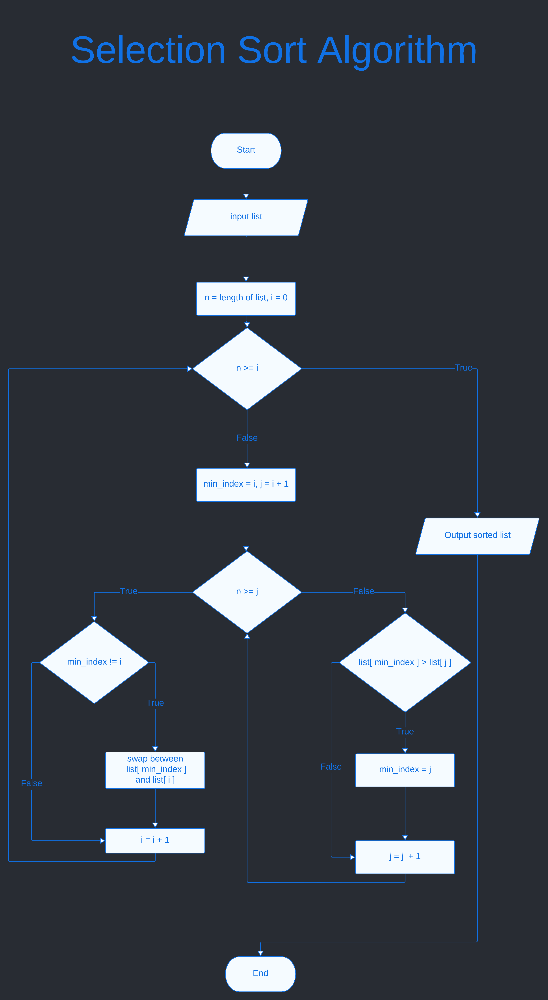
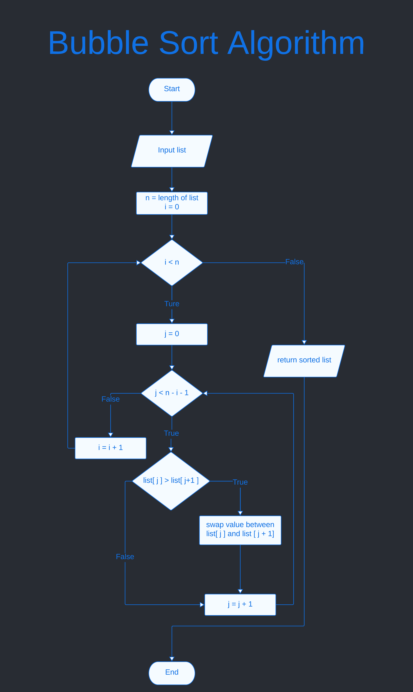
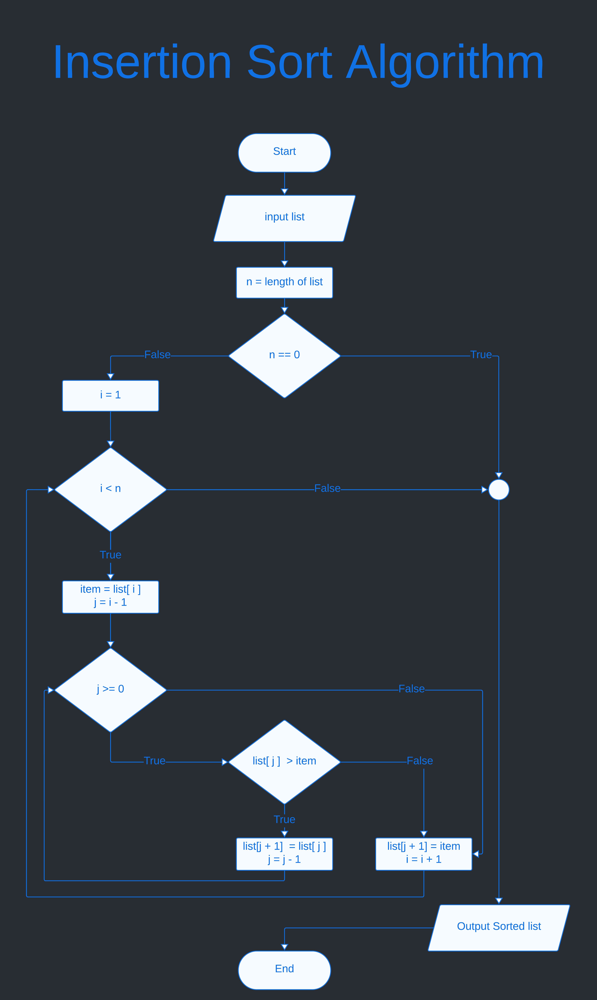

Chapter 5 : Sorting Algorithm
=============================

## Selection Sort 
**Algorithm :**

input : a list

output : sort the list

1. n = length of list 
1. i = 0
1. if n >= i then go step 10 otherwise next step
1. min_index = i, j = i + 1
1. if n >= j then go 8 otherwise next step 
1. if list[min_index] > list[j] then min_index = j
1. j = j + 1 and go back step 5
1. if min_index != i , swap list[min_index] and list[i]
1. i = i + 1 and go back step 3
1. return sorted list, list is sorted.

**Flowchart :**


**Implement Selection sort :**
```python
def selection_sort(list) : 
    n = len(list); # get length

    for i in range(0,n) :
        min_index = i;

        for j in range(i+1,n) : 
            if list[min_index] > list[j] :
                min_index = j;

        if min_index != i : 
            # swap the value between list[min_index] and list[i]
            list[min_index],list[i] = list[i],list[min_index];
    
    return list;

```

***Use selection_sort function :***
```python

if __name__ == '__main__' : 
    print("selection_sort([4,3,6,7,5,2,1]) : ",selection_sort([4,3,6,7,5,2,1]));
    print("selection_sort([43,554,34,32,1,3]) : ",selection_sort([43,554,34,32,1,3]));
    print("selection_sort([4,5,8,2,2,9,2]) : ",selection_sort([4,5,8,2,2,9,2]));
    print("selection_sort([4]) : ",selection_sort([4]));
    print("selection_sort([]) : ",selection_sort([]));
    print("selection_sort([1,2,3,4,5,6,7,8]) : ",selection_sort([1,2,3,4,5,6,7,8]));
    
```

```bash
$python3 selection_sort.py 
selection_sort([4,3,6,7,5,2,1]) :  [1, 2, 3, 4, 5, 6, 7]
selection_sort([43,554,34,32,1,3]) :  [1, 3, 32, 34, 43, 554]
selection_sort([4,5,8,2,2,9,2]) :  [2, 2, 2, 4, 5, 8, 9]
selection_sort([4]) :  [4]
selection_sort([]) :  []
selection_sort([1,2,3,4,5,6,7,8]) :  [1, 2, 3, 4, 5, 6, 7, 8]
```

***Test selection_sort.py :***
```python
def test_selection_sort() : 
    test_case = [
        {
            'name' : "simple case 0",
            'input' :    [4,3,6,7,5,2,1],
            'expected' : [1,2,3,4,5,6,7]
        },
        {
            'name' : 'simple case 1',
            'input' :    [43,554,34,32,1,3],
            'expected' : [1,3,32,34,43,554]
        },
        {
            'name' : 'simple case 2',
            'input' :    [4,5,8,2,2,9,2],
            'expected' : [2,2,2,4,5,8,9]
        },
        {
            'name' : 'simple case 3',
            'input' :    [4],
            'expected' : [4]
        },
        {
            'name' : 'simple case 4',
            'input' :   [],
            'expected': []
        },
        {
            'name' : 'simple case 5',
            'input' :    [1,2,3,4,5,6,7,8],
            'expected' : [1,2,3,4,5,6,7,8]
        }
    ]

    for case in test_case : 
        assert case['expected'] == selection_sort(case['input']), case['name']
```

```bash
$pytest selection_sort.py 
====================================== test session starts ======================================
platform linux -- Python 3.9.2, pytest-7.1.2, pluggy-1.0.0
rootdir: /home/tazri/Documents/work-place/python/learn-programming-with-python/part_3/chapter_5
collected 1 item                                                                                

selection_sort.py .                                                                       [100%]

======================================= 1 passed in 0.01s =======================================
```


**Time and space complexity :**
```python
'''
Calculate time complexity : here in loop
when i = 0,   run the inside the loop j = 1 to (n-1)   total (n-1)
when i = 1,   run the inside the loop j = 2 to (n-1)   total (n-2)
when i = 2,   run the inside the loop j = 3 to (n-1)   total (n-3)
------------------------------------------------------------------
------------------------------------------------------------------
when i = n-4, run the inside the loop j = n-3 to (n-1) total 3
when i = n-3, run the inside the loop j = n-2 to (n-1) total 2
when i = n-2, run the inside the loop j = n-1 to (n-1) total 1

total loop run = (n-1) + (n-2) + (n-3) + ......................... + 3 + 2 + 1
               = 1 + 2 + 3 + ..................................... + (n-3) + (n-2) + (n-1)
               = [{(n-1)+1}*(n-1)]/2
               = n*(n-1)/2
               = (n^2-n)/2
               = (n^2)/2 - n/2

total time complexity : O(n^2/2) - O(n/2)
                      : O(n^2)

Calculate space complexity : 
O(1) -> for n variable
O(1) -> for min_index variable
O(1) -> for i variable
O(1) -> for j variable

total space complexity : O(1) + O(1) + O(1) + O(1)
                       : 4 * O(1)
                       : O(1)

time complexity : O(n^2)
space complexity : O(1)
'''
```
<hr />
<br />

## Bubble Sort 
**Bubble Sort Algorithm :**

input : a unsorted list 
output : a sorted list 

1. n = length of list, i = 0
1. i < n, then go next step otherwise go step 8 
1. j = 0
1. j < n - 1 - i, then go next step otherwise go 7 
1. if list[j] > list[j+1] then swap the value 
1. j = j + 1, and go back step 4
1. i = i + 1 and go back 2
1. return sorted list 

**Bubble Sort Flowchart :**



**Implement Bubble Sort :**
```python
def bubble_sort(list) :
    n = len(list);

    for i in range(n) :
        for j in range(n-1-i) :
            if list[j] > list[j+1]:
                list[j],list[j+1] = list[j+1],list[j]

    return list 
```

**Use Bubble Sort :**
```python
if __name__ == '__main__' : 
    print("bubble_sort([4,3,6,7,5,2,1]) : ",bubble_sort([4,3,6,7,5,2,1]));
    print("bubble_sort([43,554,34,32,1,3]) : ",bubble_sort([43,554,34,32,1,3]));
    print("bubble_sort([4,5,8,2,2,9,2]) : ",bubble_sort([4,5,8,2,2,9,2]));
    print("bubble_sort([4]) : ",bubble_sort([4]));
    print("bubble_sort([]) : ",bubble_sort([]));
    print("bubble_sort([1,2,3,4,5,6,7,8]) : ",bubble_sort([1,2,3,4,5,6,7,8]));
```

```bash
 $python3 bubble_sort.py 
bubble_sort([4,3,6,7,5,2,1]) :  [1, 2, 3, 4, 5, 6, 7]
bubble_sort([43,554,34,32,1,3]) :  [1, 3, 32, 34, 43, 554]
bubble_sort([4,5,8,2,2,9,2]) :  [2, 2, 2, 4, 5, 8, 9]
bubble_sort([4]) :  [4]
bubble_sort([]) :  []
bubble_sort([1,2,3,4,5,6,7,8]) :  [1, 2, 3, 4, 5, 6, 7, 8]
```

**Test Bubble Sort :**
```python
def test_bubble_sort() : 
    test_case = [
        {
            'name' : "simple case 0",
            'input' :    [4,3,6,7,5,2,1],
            'expected' : [1,2,3,4,5,6,7]
        },
        {
            'name' : 'simple case 1',
            'input' :    [43,554,34,32,1,3],
            'expected' : [1,3,32,34,43,554]
        },
        {
            'name' : 'simple case 2',
            'input' :    [4,5,8,2,2,9,2],
            'expected' : [2,2,2,4,5,8,9]
        },
        {
            'name' : 'simple case 3',
            'input' :    [4],
            'expected' : [4]
        },
        {
            'name' : 'simple case 4',
            'input' :   [],
            'expected': []
        },
        {
            'name' : 'simple case 5',
            'input' :    [1,2,3,4,5,6,7,8],
            'expected' : [1,2,3,4,5,6,7,8]
        }
    ]

    for case in test_case : 
        assert case['expected'] == bubble_sort(case['input']), case['name']

```

```bash
$pytest bubble_sort.py 
============================= test session starts ==============================
platform linux -- Python 3.9.2, pytest-7.1.2, pluggy-1.0.0
rootdir: /home/tazri/Documents/work-place/python/learn-programming-with-python/p
art_3/chapter_5
collected 1 item                                                               

bubble_sort.py .                                                         [100%]

============================== 1 passed in 0.01s ================================
```

**Time and Space Complexity :**
```python
'''
Calculate time complexity : 
Here inside the loop run, 
when i = 0,      inside loop run j = 0 to (n-1) total n - 1
when i = 1,      inside loop run j = 0 to (n-2) total n - 2
when i = 2,      inside loop run j = 0 to (n-3) total n - 3
when i = 3,      inside loop run j = 0 to (n-4) total n - 4
------------------------------------------------------------
------------------------------------------------------------
when i = n - 3,  inside loop run j = 0 to 2     total 2
when i = n - 2,  inside loop run j = 0 to 1     total 1
when i = n - 1,  inside loop run j = 0 to 0     total 0

total time complexity : 
    1 + 2 + 3 + ..... + (n-4) + (n-3) + (n-2) + (n-1)
  = [{(n-1)+1}(n-1)] / 2
  = {n(n-1)}/2
  = (n^2-n)/2
  = n^2/2 - n/2
  = O(n^2) - O(n/2)
  = O(n^2)


Calculate space complexity : 
O(1) -> for i variable
O(1) -> for j variable
O(1) -> for n variable

total space complexity is : O(1) + O(1) + O(1)
                          = 3 * O(1)
                          = O(1)

time complexity : O(n^2) 
space compexity : O(1)  
'''

```

<hr />
<br />

## Insertion Sort 
**Insertion Sort Algorithm :**

Input : A unsorted list 
Output : sorted the list 

1. n = length of list 
1. if n == 0 then go step 13 otherwise go next step 
1. i = 1
1. i < n then go next step otherwise go step 13 
1. item = list[i]
1. j = i - 1
1. j >= 0 then go next step otherwise go step 11
1. if list[j] > item then go next step otherwise go step 11
1. list[j+1] = list[j] 
1. j = j - 1 and go back step 7
1. list[j+1] = item and go next step
1. i = i + 1 and go back step 4
1. return sorted list 

**Insertion Sort Flowchart :**



**Implement Insertion Sort :**

```python
def insertion_sort(list) :
    n = len(list);

    if (n == 0) or (n == 1) :
        return list 

    for i in range(1,n):
        item = list[i];
        j = i - 1;

        while j >= 0 :
            if list[j] > item :
                list[j+1] = list[j]
            else : 
                break

            j = j - 1;

        list[j+1] = item;

    return list 
```

**Using Insertion Sort :**

```python
if __name__ == '__main__' : 
    print("insertion_sort([4,3,6,7,5,2,1]) : ",insertion_sort([4,3,6,7,5,2,1]));
    print("insertion_sort([43,554,34,32,1,3]) : ",insertion_sort([43,554,34,32,1,3]));
    print("insertion_sort([4,5,8,2,2,9,2]) : ",insertion_sort([4,5,8,2,2,9,2]));
    print("insertion_sort([4]) : ",insertion_sort([4]));
    print("insertion_sort([]) : ",insertion_sort([]));
    print("insertion_sort([1,2,3,4,5,6,7,8]) : ",insertion_sort([1,2,3,4,5,6,7,8]));
```

```bash
$python3 insertion_sort.py 
insertion_sort([4,3,6,7,5,2,1]) :  [1, 2, 3, 4, 5, 6, 7]
insertion_sort([43,554,34,32,1,3]) :  [1, 3, 32, 34, 43, 554]
insertion_sort([4,5,8,2,2,9,2]) :  [2, 2, 2, 4, 5, 8, 9]
insertion_sort([4]) :  [4]
insertion_sort([]) :  []
insertion_sort([1,2,3,4,5,6,7,8]) :  [1, 2, 3, 4, 5, 6, 7, 8]
```

**Testing insertion_sort :**

```python
def test_insertion_sort() : 
    test_case = [
        {
            'name' : "simple case 0",
            'input' :    [4,3,6,7,5,2,1],
            'expected' : [1,2,3,4,5,6,7]
        },
        {
            'name' : 'simple case 1',
            'input' :    [43,554,34,32,1,3],
            'expected' : [1,3,32,34,43,554]
        },
        {
            'name' : 'simple case 2',
            'input' :    [4,5,8,2,2,9,2],
            'expected' : [2,2,2,4,5,8,9]
        },
        {
            'name' : 'simple case 3',
            'input' :    [4],
            'expected' : [4]
        },
        {
            'name' : 'simple case 4',
            'input' :   [],
            'expected': []
        },
        {
            'name' : 'simple case 5',
            'input' :    [1,2,3,4,5,6,7,8],
            'expected' : [1,2,3,4,5,6,7,8]
        }
    ]

    for case in test_case : 
        assert case['expected'] == insertion_sort(case['input']), case['name']

```

```bash
$pytest insertion_sort.py 
============================= test session starts ==============================
platform linux -- Python 3.9.2, pytest-7.1.2, pluggy-1.0.0
rootdir: /home/tazri/Documents/work-place/python/learn-programming-with-python/p
art_3/chapter_5
collected 1 item                                                               

insertion_sort.py .                                                      [100%]

============================== 1 passed in 0.01s ===============================
```

**Time and space complexity :**
```python
'''
Calculate time complexity of insertion sort : 
Here inside loop run 
i = 1 ,     the loop run 0 to j = 0   total 1
i = 2 ,     the loop run 0 to j = 1   total 2
i = 3 ,     the loop run 0 to j = 2   total 3
-------------------------------------------------
-------------------------------------------------
i = n - 3,  the loop run 0 to j = n-2 total n - 3
i = n - 2,  the loop run 0 to j = n-1 total n - 2
i = n - 1,  the loop run 0 to j = n   total n - 1

total loop run : 
= 1 + 2 + 3 + ............ + (n-3) + (n-2) + (n-1) 
= [{(n-1)+1}*(n-1)]/2
= {n*(n-1)}/2
= (n^2-n)/2
= n^2/2 - n/2
total time complexity : O(n^2/2) - O(n/2)
                      : O(n^2/2)
                      : O(n^2)

Calculate space complexity of insertion sort :
O(1) -> for n variable
O(1) -> for item variable
O(1) -> for i variable
O(1) -> for j variable

total space complexity : O(1) + O(1) + O(1) + O(1)
                       : 4 * O(1)
                       : O(1)


time complexity : O(n^2)
space complexity: O(1)
'''
```

<hr />
<br />

[< Go Back](./../part_3.md)
---------------------------