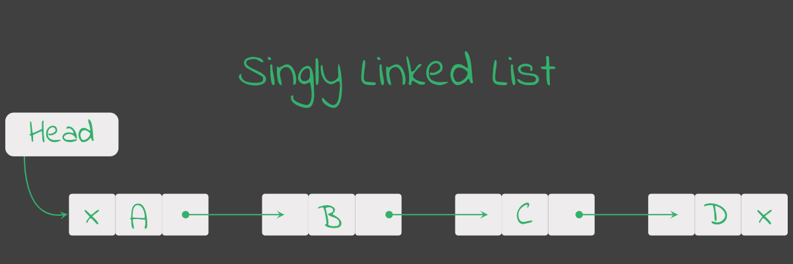

Chapter 7 : Linked List
=======================


## Singly Linked List 
**Linked List** is a linear data structure. Linked list element are not sorted by location. The elements are linked using a pointer. They includes a series of connected nodes. Where every node stores data and the address of next node. **Every single element in linked list called node.**

**Here what node store :**
1. Store data. 
1. Store only next node address for sinlgy linked list.

**Here all feature about linked list :**
1. first node of linked list called **head**.
1. last node of linked list linked with **Null** Pointing.

**In Image View of Singly Linked List :**



**Operation of linked list :**
1. **Append**
    1. Add new node in linked list at last position. 
    1. linked with last node in linked list.
    1. set as it tail. 
2. **Prepend**
    1. add node in linked list at first position.
    1. linked with first node in linked list.
    1. set as it head.
3. **Insert**
    1. Add new node in linked list spacify position.
4. **Search**
    1. Take a data.
    1. Searching for data in linked list.
    1. return first finding node in linked list what matching with data.
    1. if not found in list then return None.
5. **remove**
    1. take data.
    1. if data matching with node data in linked list then remove it from linked list.
    1. matching first node in linked list if it was matching. 

**Sinlgy Linked List Implementation :**
```python
# create Node class
class Node:
    def __init__(self,_data = None,_next = None):
        self.data = _data;
        self.next = _next;
    
    def __repr__(self):
        return self.data;


# create linked list 
class Linked_List:
    # constructor 
    def __init__(self):
        # set head of link list
        self.head = Node();

    # repr -> print the linked list
    def __repr__(self):
        datas = [];
        current_node = self.head.next;

        while current_node :
            datas.append(current_node.data);
            current_node = current_node.next;

        datas = 'linked_list'+str(datas);
        return datas;

    # append -> add node in last position of linked list
    def append(self,_data):
        # create node 
        node = Node(_data);

        current_node = self.head;

        while current_node.next :
            current_node = current_node.next;
        
        current_node.next = node;

        return 1;
    
    # appends -> add multiple item in linked list in last position
    def appends(self,_items):
        for _item in _items :
            self.append(_item);
        return 1;

    # prepend -> add node in first position of linked list
    def prepend(self,_data):
        # create node
        node = Node(_data);

        first_node = self.head.next;
        self.head.next = node;
        self.head.next.next = first_node;

        return 1;

    # prepends -> add multiple item in linked list in first position
    def prepends(self,_items):
        for _item in _items:
            self.prepend(_item);
        return 1;

    # search -> finding the node
    def search(self,_item):
        current_node = self.head.next;

        while current_node :
            if current_node.data == _item :
                return current_node;
            
            current_node = current_node.next;
        
        return None

    # insert -> insert a item next to spacify node
    def insert(self,_data,_insert_data):
        # searhing _data in list
        target_node = self.search(_data);

        if target_node is None :
            return False;

        # insert data
        next_node = target_node.next;
        new_node = Node(_insert_data,next_node);
        target_node.next = new_node;
        return True;

    # dequeue
    def dequeue(self):
        # if linked list was empty
        if self.head.next == None :
            return None;
        
        first_node = self.head.next;
        secound_node = first_node.next;
        self.head.next = secound_node;

        return first_node;

    # remove -> remove the first item from list
    def remove(self,_item):
        # if list was empty
        if self.head.next == None :
            return None;

        # if it was first data
        if self.head.next.data == _item :
            remove_node = self.dequeue();
            return remove_node;

        # remove item 
        current_node = self.head.next;
        while current_node :
            next_node = current_node.next;

            # if next node is None
            if next_node == None :
                return None;
            
            # if find the data in next node then delete it
            if next_node.data == _item :
                current_node.next = next_node.next;
                return next_node;

            current_node = current_node.next;

        return None;
```

**Using Sinlgy Linked List :**
```bash
>>> import Linked_List
>>> li = Linked_List.Linked_List()
>>> li
linked_list[]
>>> li.append('tazri')
1
>>> li
linked_list['tazri']
>>> li.prepend('erwin')
1
>>> li
linked_list['erwin', 'tazri']
>>> li.appends(['alayth','focasa'])
1
>>> li
linked_list['erwin', 'tazri', 'alayth', 'focasa']
>>> li.prepends(['ultra','antra'])
1
>>> li
linked_list['antra', 'ultra', 'erwin', 'tazri', 'alayth', 'focasa']
>>> li.remove('antra')
antra
>>> li
linked_list['ultra', 'erwin', 'tazri', 'alayth', 'focasa']
>>> li.dequeue()
ultra
>>> li
linked_list['erwin', 'tazri', 'alayth', 'focasa']
>>> li.remove('alayth')
alayth
>>> li
linked_list['erwin', 'tazri', 'focasa']
>>> p = li.search('tazri')
>>> p
tazri
>>> p.next
focasa
>>> li.insert('tazri','alatyh')
True
>>> li
linked_list['erwin', 'tazri', 'alatyh', 'focasa']
>>> 
```

## Doubly Linked List 
**Doubly Linked List** same as Singly Linked Link list but deferent is that every node of doubly linked list contain two two node address, previous and next node address. Here image : 


**Implementation Doubly Linked List :**
```python
# Node class
class Node : 
    # intial the data
    def __init__(self,_data = None,_prev = None,_next = None):
        self.data,self.prev,self.next = _data,_prev,_next;

    # repr -> for what show node in print
    def __repr__(self):
        return self.data;


# Doubly_Linked_List
class Doubly_Linked_List:
    # constructor for intial the value
    def __init__(self):
        self.head = Node('head');
        self.length = 0;

    # repr -> for show the value
    def __repr__(self):
        nodes = [];
        current_node = self.head.next;

        if current_node is None : 
            return 'Doubly_Linked_List[ !! Empty !! ]'

        while current_node :
            nodes.append(current_node.data);
            current_node = current_node.next;

        return 'Doubly_Linked_List' + str(nodes);

    
    # append -> add item in linked list at last position 
    def append(self,_data):
        # create nodes 
        new_node = Node(_data);

        # append the node 
        current_node = self.head;

        while current_node.next :
            current_node =  current_node.next;

        current_node.next = new_node;
        new_node.prev = current_node;

        self.length += 1;
        return self;

    # appends -> add multiple item in linked list at last position
    def appends(self,_datas):
        total_data = 0;
        for _data in _datas:
            self.append(_data);
            total_data += 1;

        return self;

    # prepend -> add item in linked list at first position
    def prepend(self,_data):
        # create node
        new_node = Node(_data);

        # add item at first position
        first_node = self.head.next;
        new_node.next = first_node;

        if first_node != None :
            first_node.prev = new_node

        self.head.next = new_node;

        self.length += 1;
        return self;
    
    # prepends -> add multiple item in linked list at first position
    def prepends(self,_datas):
        datas = _datas.copy();

        while datas :
            self.prepend(datas.pop());

        return self;

    # insert -> add a value after a spacify value
    def insert(self,_target_data,_new_data):
        # find the target node
        target_node = self.search(_target_data);

        if not target_node :
            return None;

        # create node
        new_node = Node(_new_data);

        # get next node
        next_node = target_node.next;
        # add new node in list
        target_node.next = new_node;
        new_node.prev = target_node;
        new_node.next = next_node;

        if not None : 
            next_node.prev = new_node;

        return self;

    # search -> return the finding item in linked list
    def search(self,_data):
        # if linked list is empty
        if self.head.next == None :
            return None;

        current_node = self.head.next;

        while current_node :
            if current_node.data == _data :
                return current_node;

            current_node = current_node.next;

        return None;

    # remove -> remove the item in linked list at position in linked list
    def remove(self,_data):
        target = self.search(_data);

        # if item is not exist
        if target == None : return None;

        # if target node is first node then 

        # get next and prev node
        prev_node = target.prev;
        next_node = target.next;

        # remove target node
        prev_node.next = next_node;
        if next_node != None :
            next_node.prev = prev_node;
        
        return target;
```

**Using Doubly Linked List :**
```bash
Python 3.9.2 (default, Feb 28 2021, 17:03:44) 
[GCC 10.2.1 20210110] on linux
Type "help", "copyright", "credits" or "license" for more information.
>>> import Doubly_Linked_List
>>> dll = Doubly_Linked_List.Doubly_Linked_List()
>>> dll.append(2).append(3)
Doubly_Linked_List[2, 3]
>>> dll.appends([33,22]).appends([5])
Doubly_Linked_List[2, 3, 33, 22, 5]
>>> dll.prepend(0).prepend(1)
Doubly_Linked_List[1, 0, 2, 3, 33, 22, 5]
>>> dll.prepends([11,12]).prepends([111])
Doubly_Linked_List[111, 11, 12, 1, 0, 2, 3, 33, 22, 5]
>>> dll.search(8)
>>> d = dll.search(8)
>>> d
>>> dll.search(111)
111
>>> dll.search(111).next
11
>>> dll.remove(12)
12
>>> dll
Doubly_Linked_List[111, 11, 1, 0, 2, 3, 33, 22, 5]
>>> dll.insert(120,0)
>>> dll
Doubly_Linked_List[111, 11, 1, 0, 2, 3, 33, 22, 5]
>>> dll.insert(0,120)
Doubly_Linked_List[111, 11, 1, 0, 120, 2, 3, 33, 22, 5]
>>> dll.remove(1)
1
>>> dll.remove(5)
5
```

**Test Doubly Linked List :**
```bash
============================= test session starts ==============================
platform linux -- Python 3.9.2, pytest-7.1.2, pluggy-1.0.0
rootdir: /home/tazri/Documents/work-place/python/learn-programming-with-python/p
art_3/chapter_7
collected 4 items                                                              

test/test_doubly_linked_list.py ....                                     [100%]

============================== 4 passed in 0.04s ===============================
```
[Test Code](./test/test_doubly_linked_list.py)

<hr />
<br />


[< Go Back](./../part_3.md)
---------------------------