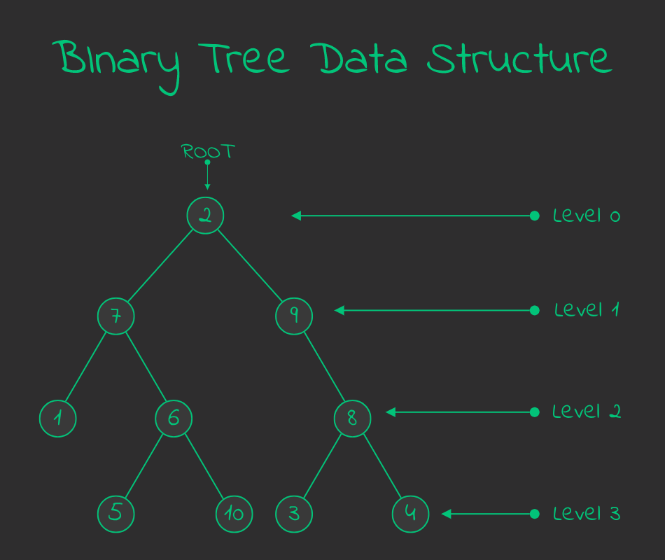
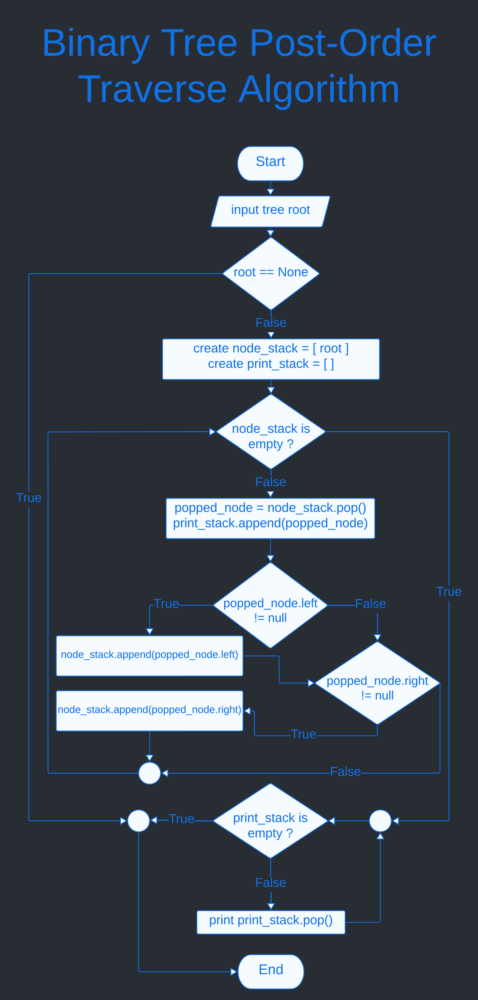

Chapter 9 : Tree
=================

A tree is non-linear and a hirearchical data structure consisting of a collection of nodes such that each node of the tree stores a value and a list of references to other nodes (the "children"). Here all some attribute of tree data structure :

- Every element of tree data structure called node.
- First node of tree data structure called root.
- Root level is 0.
- Every node level is 1 more than it's parent node except root node.

**Here simple picture of tree data structure :**


<hr />
<br />

## Binary Tree Data Structure 
Binary tree data structure is a tree data structure where every node is capable to contain only 2 node called left and right. Tree data structure attribute is : 

- Every node capable to contain two node.
- Every node has parent node except root node.
- Every parent node capable to contain two child called left and right.
- Root level is 0.
- Every node level is more than one of parent node level. 

**Here simple picture of binary tree data structure :**



**Implement Binary Tree Node :**
```python
# binary node
class TreeNode : 
    # constructor 
    def __init__(self,_data=None,_left=None,_right=None,_parent=None):
        self.data = _data;
        self.left = _left;
        self.right = _right;
        self.parent = _parent;

    # show data
    def __repr__(self):
        return str(self.data);

    # add_left -> add node to left
    def add_left(self,_node):
        self.left = _node;
        
        if not _node :
            _node.parent = self;
    
    # add_right -> add node to right
    def add_right(self,_node):
        self.right = _node;
        
        if not _node :
            _node.parent = self;
```

### Traverse Binary Tree 
There are three algorithm two traverse binary tree. Here : 
1. pre-order
1. post-order
1. in-order

<hr />
<br />

## pre-order   
In this algorithm first visit root node. Than traverse left child and last traverse right child.

**Pre-Order Traverse Binary Tree Algorithm :**

input : tree root
1. Visit root node.
1. Traverse left sub tree.
1. Traverese right sub tree.

**Pre_Order Traverse Binary Tree Algorithm in Details :**

input : tree root

1. start
1. create root_stack = []
1. root_stack.append(root) 
1. if root_stack is empty then go step 10 otherwise go next step
1. current_root = root_stack.pop()
1. print current_root data
1. if current_root.right exist then, root_stack.append(current_root.right)
1. if current_root.left exist then, root_stack.append(current_root.left)
1. go back step 4
1. end.

**Flow chart Pre-Order binary tree traverse algorithm :**


**Example of Pre-Order :**


If traverse the above binary node in pre-order then, first visit B, then traverse left and print A and last traverse right and print C. Here simple output : 

```bash
'''
pre-order traverse :
    _B_
   /   \
  A     C

output :
B,A,C
'''
```

**Implement Pre-Order Algorithm in recursive way :**

```python
# pre-order traverse binary tree in recursive
def traverse_pre_order(_root):
    # first print root data
    print(_root);

    # if left child exist than print it first.
    if _root.left :
        traverse_pre_order(_root.left);

    # if right child exist than print it.
    if _root.right :
        traverse_pre_order(_root.right);

```

**traverse_pre_order function on above tree data structure :**
```python
if __name__ == "__main__" :
    '''
    Create below tree data structure
            _2_
           /   \
          7     9
         / \     \
        1   6     8
           / \   / \
          5  10 3   4
    '''
    root = create_tree();
    
    # pre_order traverse in recursive
    print(">>> Traverse Pre Order in Recursive Way <<<");
    traverse_pre_order(root);

```

output :
```bash
>>> Traverse Pre Order in Recursive Way <<<
2
7
1
6
5
10
9
8
3
4
```

**Implement pre_order binary tree traverse in iterative way :**
```python
# pre-order traverse binary tree in iterative way
def traverse_pre_order_iteravite(_root):
    # create root stack
    root_stack = [_root];

    while root_stack:
        # get root from stack and print
        current_root = root_stack.pop();
        print(current_root);

        # if right root exist then append it to root stack
        if current_root.right :
            root_stack.append(current_root.right);
        
        # if left root exist then append it to root stack
        if current_root.left :
            root_stack.append(current_root.left);
```

**Use traverse_pre_order_iterative funciton :**
```python
if __name__ == "__main__" :
    '''
    Create below tree data structure
            _2_
           /   \
          7     9
         / \     \
        1   6     8
           / \   / \
          5  10 3   4
    '''
    root = create_tree();

    # pre_roder traverse in iterative way
    print("\n>>> Traverse Pre Order in Iterative Way <<<");
    traverse_pre_order_iteravite(root);
```

output : 
```bash
>>> Traverse Pre Order in Iterative Way <<<
2
7
1
6
5
10
9
8
3
4
```

<hr />
<br />


## post-order 
post order binary tree traverse, first travere the left sub tree and than traverse the right sub tree. Last vist the root.

**post-order binary tree traverse algorithm :**

input : tree root 
1. visit left subtree.
1. visit right subtree.
1. visit root node.

**post-order binary tree traverse algorithm in details :**

input : tree root 
1. start
1. input tree root
1. if root is null then go step
1. create node_stack = [] and print_stack = []
1. node_stack.push(root)
1. if node_stack is empty then go step 12
1. popped_node = node_stack.pop();
1. if popped_node.left exist then node_stack.push(popped_node.left)
1. if popped_node.right exist then node_stack.push(popped_node.right)
1. print_stack.push(popped_node)
1. go back step 5
1. if print_stack empty then go 14
1. print print_stack.pop()
1. end

**Flowchat Post Order Binary Tree Traverse :**



**Example of Post order :**


If we traverse above binary tree then the output will : A,C,B

```python
'''
    _B_
   /   \
  A     C

post-order output : B,A,C
'''
```

**Implement post-order binary tree traverse in recursive :**
```python
# post-order traverse binary tree in recursive 
def traverse_post_order(_root):
    # if left exist 
    if _root.left :
        traverse_post_order(_root.left);

    # if right exist
    if _root.right :
        traverse_post_order(_root.right);
    
    # and print the root
    print(_root);

```

**Use traverse_post_order function on tree :**
```python
if __name__ == "__main__" :
    '''
    Create below tree data structure
            _2_
           /   \
          7     9
         / \     \
        1   6     8
           / \   / \
          5  10 3   4
    '''

    # post_order traverse in recursive 
    print(">>> Traverse Post Order in Recursive Way <<<");
    traverse_post_order(root);
```

output :
```bash
>>> Traverse Post Order in Recursive Way <<<
1
5
10
6
7
3
4
8
9
2
```

**Implement post-order binary tree traverse in iterative :**
```python
# post-order traverse binary tree in iterative
def traverse_post_order_iterative(_root):
    # if _root is None 
    if _root == None :
        return;

    # create node_stack and print_stack
    node_stack = [_root];
    print_stack = []; # here contain data to print 

    while node_stack :
        popped_node = node_stack.pop();

        # if left and right exist then first left push after right push to node stack
        if popped_node.left :
            node_stack.append(popped_node.left);

        if popped_node.right :
            node_stack.append(popped_node.right);

        # push the popped node to print_stack
        print_stack.append(popped_node);
             
    while print_stack :
        print(print_stack.pop());
```

**Use traverse_post_order_iterative function**
```python
if __name__ == "__main__" :
    '''
    Create below tree data structure
            _2_
           /   \
          7     9
         / \     \
        1   6     8
           / \   / \
          5  10 3   4
    '''
    root = create_tree();

    # post_order traverse in iterative 
    print(">>> Traverse Post Order in Iterative Way <<<");
    traverse_post_order_iterative(root);
```

output :
```bash
>>> Traverse Post Order in Iterative Way <<<
1
5
10
6
7
3
4
8
9
2
```

<hr />
<br />