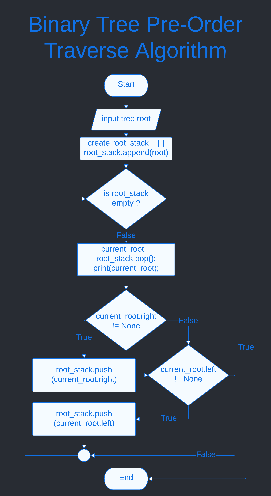

Chapter 9 : Tree
=================

A tree is non-linear and a hirearchical data structure consisting of a collection of nodes such that each node of the tree stores a value and a list of references to other nodes (the "children"). Here all some attribute of tree data structure :

- Every element of tree data structure called node.
- First node of tree data structure called root.
- Root level is 0.
- Every node level is 1 more than it's parent node except root node.

**Here simple picture of tree data structure :**


<hr />
<br />

## Binary Tree Data Structure 
Binary tree data structure is a tree data structure where every node is capable to contain only 2 node called left and right. Tree data structure attribute is : 

- Every node capable to contain two node.
- Every node has parent node except root node.
- Every parent node capable to contain two child called left and right.
- Root level is 0.
- Every node level is more than one of parent node level. 

**Here simple picture of binary tree data structure :**


**Implement Binary Tree Node :**
```python
# binary node
class TreeNode : 
    # constructor 
    def __init__(self,_data=None,_left=None,_right=None,_parent=None):
        self.data = _data;
        self.left = _left;
        self.right = _right;
        self.parent = _parent;

    # show data
    def __repr__(self):
        return str(self.data);

    # add_left -> add node to left
    def add_left(self,_node):
        self.left = _node;
        
        if not _node :
            _node.parent = self;
    
    # add_right -> add node to right
    def add_right(self,_node):
        self.right = _node;
        
        if not _node :
            _node.parent = self;
```
<hr />
<br />

## Traverse Binary Tree 
There are three algorithm two traverse binary tree. Here : 
1. pre-order
1. post-order
1. in-order

### pre-order   
In this algorithm first visit root node. Than traverse left child and last traverse right child.

**Pre-Order Algorithm :**

input : tree, root
1. Visit root node.
1. Traverse left sub tree.
1. Traverese right sub tree.

**Flow chart Pre-Order binary tree traverse algorithm :**



**Example of Pre-Order :**


If traverse the above binary node in pre-order then, first visit B, then traverse left and print A and last traverse right and print C. Here simple output : 

```bash
'''
pre-order traverse :
    _B_
   /   \
  A     C

output :
B,A,C
'''
```

**Implement Pre-Order Algorithm in recursive way :**

```python
# pre-order traverse binary tree in recursive
def traverse_pre_order(_root):
    # first print root data
    print(_root);

    # if left child exist than print it first.
    if _root.left :
        traverse_pre_order(_root.left);

    # if right child exist than print it.
    if _root.right :
        traverse_pre_order(_root.right);

```

**traverse_pre_order function on above tree data structure :**
```python
if __name__ == "__main__" :
    '''
    Create below tree data structure
            _2_
           /   \
          7     9
         / \     \
        1   6     8
           / \   / \
          5  10 3   4
    '''
    root = create_tree();
    
    # pre_order traverse in recursive
    print(">>> Traverse Pre Order in Recursive Way <<<");
    traverse_pre_order(root);

```

output :
```bash
>>> Traverse Pre Order in Recursive Way <<<
2
7
1
6
5
10
9
8
3
4
```