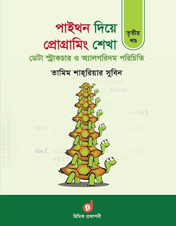

Learn Programming by Python 3rd Part, Tamim Shahriar Subeen
==================================================

This is the note of Secound part of **Tamim Shahriar Subeen** books on python. Where discuss about basic programming. Here I compete all the book and documented it here. Also I code every single of code in the book. 

Table of Content
-----------------

[< Go Back README.md File](./../README.md)
------------------------------------------