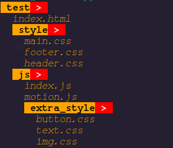

My Folder Traverse Program 
===========================
Here I document the [my program](./../02.traverse_folders.py) into smalls part to understand : 

- **[make_color function](#make_color-function)**
- **[print_files function](#print_files-function)**
- **[print_folder function](#print_folder-function)**
- **[Folder class](#folder-class)**
- **[extract_dir_recursive function](#extract_dir_recursive-function)**
- **[Main Program](#main-program)**
- **[Whole Program](#whole-program)**

<hr />

## make_color function 
Here it all argument list : 
```py
first text(type string) : text which is to print
second fg(tuple,default=None) : take a foreground or text color as a rgb like (244,33,22)
third bg(tuple,default=None) : take a backgournd color as a rbg like (233,445,432)
forth style(tuple,default=None) : take a ascii style code like (1,3) e.g here 1 for bold and 3 for italic

here more style which is follow **ANSI escape code**
1 -> bold
3 -> italic | 23 -> not italic
4 -> underline | 24 -> not underline
5 -> slow blink | 25 -> not blinking
6 -> Rapid blink
39 -> default foreground color
49 -> default background color

# below thing is not for style
Here code for only color : 
30-37 : foreground color
40-47 : background color

Custom code for only color : 
38;2;r;g;b : foreground color here r,g,b = 0-255
48;2;r;g;b : background color here r,g,b = 0-255
```

Here the **make_color** whole defination : 
```py
def make_color(text:str,fg:tuple[int]=None,bg:tuple[int]=None,style=None)->str:
    # fg mean foreground color give it like (r(int),g(int),b(int))
    # bg mean background color give it like (r(int),g(int),b(int))
    # style gibe by tuple with ascci style code
    # create ASCII color string
    color_str = "\033[";

    # set foreground or text color
    if fg == None:
        color_str += "39;";
    else:
        color_str += "38;2;"
        fg_color = ";".join([str(color_code) for color_code in fg]);
        color_str += fg_color;

    # set background color
    if bg != None:
        # need to another parameter
        color_str += ";48;2;";
        fg_color = ";".join([str(color_code) for color_code in bg]);
        color_str+= fg_color;

    # add style
    if style != None :  
        style_str = ';'.join([str(style_code) for style_code in style]);
        color_str += ";" + style_str;

    color_str += "m" + text + "\033[0m";
    return color_str;
```

<hr />

## print_files function
print_files take a **files** tuples where store the **files** name as strings and get a **indention** which default value is empty string(""). Print the file from **files** line by line. But before the print a single file name first print **indention**. print file name with orange color.

Here the function defination : 
```py
# print files
def print_files(files:tuple[str],indention:str=''):
    for file in files:
        file_name = indention+file;
        color_text = make_color(file_name,color_list['orange'],style=(3,));
        print(color_text);
```

<hr />

## print_folder function
```py
# print folder
def print_folder_name(folder_name:str,indention:str='',arrow:str=" > "):
    style_arrow = make_color(arrow,color_list['white'],color_list['red'],(1,6));
    dir_name = make_color(" "+folder_name,color_list['black'],color_list['orange'],(1,));
    
    print(indention+dir_name+style_arrow);
```

<hr />

## Folder class
```py
class Folder:
    def __init__(self,name:str,path:str,files:tuple=(),folders:tuple=()):
        self.name = name;
        self.path = path;
        self.files = tuple(files);
        self.folders = tuple(folders)
        self.total_files = len(files);
        self.total_folders = len(folders);
        self.total_entity = self.total_files + self.total_folders;

    # present the folder details
    def __repr__(self) -> str:
        # extract from self
        name,path,files,folders = self.name, self.path,self.files,self.folders;

        # create output str
        file_with_path = f"dir {name} -> {path}";
        files_names = f"> files({len(files)}) -> {files}"
        folder_names = f"> folders({len(folders)}) -> {[folder.name for folder in folders]}";
        
        return f"{file_with_path}\n{files_names}\n{folder_names}";

    # set files
    def set_files(self,files:list[str]):
        self.files = tuple(files);
        self.total_files = len(files);
        self.total_entity = self.total_folders + self.total_files;
        return self;

    # set folders
    def set_folders(self,folders:list)->None:
        self.folders = tuple(folders);
        self.total_folders = len(folders);
        self.total_entity = self.total_files + self.total_folders;
        return self;

    # is empty
    def is_empty(self)->int:
        return False if self.total_entity else True;

    # get files
    def get_files(self):
        return self.files;

    # get folder
    def get_folders(self):
        return self.folders;

    def show_tree(self):
        # first show the files
        # like below
        '''
        Project > 
            index.html
            READEME.md
            test > 
                libtest.js
                mathtest.js
            style >
                main.css
                index.css
        '''

        # create necessary variable
        folders:list[Folder] = [self]; # stack
        current_folders_number = len(folders);
        folder_indent = ''; # indention for folder
        file_indent = '  '; # indention for file

        while len(folders):
            # get folders and file 
            folder = folders.pop(0); # get one folder
            files = folder.get_files(); # get all file in folder
            folders_list = folder.get_folders(); # get all folders in folder
            current_folders_number -= 1; # dcrease the current folder

            # first print folder name
            if(folder.is_empty()):
                print_folder_name(folder.name+" ",folder_indent," (empty) ");
            else : 
                print_folder_name(folder.name,folder_indent);

            # print files
            print_files(files,file_indent);

            # if folders_list exist then update the folder
            if folders_list:
                # update folders
                folders = folders + list(folders_list);

            if current_folders_number <= 0:
                current_folders_number = len(folders);
                folder_indent += "  ";
                file_indent += "  ";
```

<hr />

## extract_dir_recursive function
```py
def extract_dir_recursive(path:str,name:str):
    folder = Folder(name,path);
    
    folders_name:list[str] = [];
    inside_files:list[str] = [];

    # get all files and folders
    with os.scandir(path) as it :
        for entry in it: 
            if entry.name.startswith("."):
                continue;
            elif entry.is_dir():
                folders_name.append(entry.name);
            elif entry.is_file():
                inside_files.append(entry.name);

    # update files
    folder.set_files(inside_files);
    folders = [];

    # update folder
    for name in folders_name:
        name_path = path + "/" + name;
        name_folder = extract_dir_recursive(name_path,name);
        folders.append(name_folder);

    folder.set_folders(folders);

    return folder;
```

<hr />

## Main Program
```py
if __name__ == "__main__":
    folder_path = "./test";

    test_folder = extract_dir_recursive(folder_path,'test');

    test_folder.show_tree();
```


## Whole Program : 
Here the all program : 
```py 
import os

color_list:dict[str:tuple] = {
    'red' : (255,0,0),
    'green' : (0,255,0),
    'blue' : (0,0,255),
    'white' : (255,255,255),
    'orange' : (255,165,0),
    'coral' : (255,127,80),
    'black' : (0,0,0)
}

def make_color(text:str,fg:tuple[int]=None,bg:tuple[int]=None,style=None)->str:
    # fg mean foreground color give it like (r(int),g(int),b(int))
    # bg mean background color give it like (r(int),g(int),b(int))
    # style gibe by tuple with ascci style code
    # create ASCII color string
    color_str = "\033[";

    # set foreground or text color
    if fg == None:
        color_str += "39;";
    else:
        color_str += "38;2;"
        fg_color = ";".join([str(color_code) for color_code in fg]);
        color_str += fg_color;

    # set background color
    if bg != None:
        # need to another parameter
        color_str += ";48;2;";
        fg_color = ";".join([str(color_code) for color_code in bg]);
        color_str+= fg_color;

    # add style
    if style != None :  
        style_str = ';'.join([str(style_code) for style_code in style]);
        color_str += ";" + style_str;

    color_str += "m" + text + "\033[0m";
    return color_str;


# print files
def print_files(files:tuple[str],indention:str=''):
    for file in files:
        file_name = indention+file;
        color_text = make_color(file_name,color_list['orange'],style=(3,));
        print(color_text);

# print folder
def print_folder_name(folder_name:str,indention:str='',arrow:str=" > "):
    style_arrow = make_color(arrow,color_list['white'],color_list['red'],(1,6));
    dir_name = make_color(" "+folder_name,color_list['black'],color_list['orange'],(1,));
    print(indention+dir_name+style_arrow);

    
class Folder:
    def __init__(self,name:str,path:str,files:tuple=(),folders:tuple=()):
        self.name = name;
        self.path = path;
        self.files = tuple(files);
        self.folders = tuple(folders)
        self.total_files = len(files);
        self.total_folders = len(folders);
        self.total_entity = self.total_files + self.total_folders;

    # present the folder details
    def __repr__(self) -> str:
        # extract from self
        name,path,files,folders = self.name, self.path,self.files,self.folders;

        # create output str
        file_with_path = f"dir {name} -> {path}";
        files_names = f"> files({len(files)}) -> {files}"
        folder_names = f"> folders({len(folders)}) -> {[folder.name for folder in folders]}";
        
        return f"{file_with_path}\n{files_names}\n{folder_names}";

    # set files
    def set_files(self,files:list[str]):
        self.files = tuple(files);
        self.total_files = len(files);
        self.total_entity = self.total_folders + self.total_files;
        return self;

    # set folders
    def set_folders(self,folders:list)->None:
        self.folders = tuple(folders);
        self.total_folders = len(folders);
        self.total_entity = self.total_files + self.total_folders;
        return self;

    # is empty
    def is_empty(self)->int:
        return False if self.total_entity else True;

    # get files
    def get_files(self):
        return self.files;

    # get folder
    def get_folders(self):
        return self.folders;

    def show_tree(self):
        # first show the files
        # like below
        '''
        Project > 
            index.html
            READEME.md
            test > 
                libtest.js
                mathtest.js
            style >
                main.css
                index.css
        '''

        # create necessary variable
        folders:list[Folder] = [self]; # stack
        current_folders_number = len(folders);
        folder_indent = ''; # indention for folder
        file_indent = '  '; # indention for file

        while len(folders):
            # get folders and file 
            folder = folders.pop(0); # get one folder
            files = folder.get_files(); # get all file in folder
            folders_list = folder.get_folders(); # get all folders in folder
            current_folders_number -= 1; # dcrease the current folder

            # first print folder name
            if(folder.is_empty()):
                print_folder_name(folder.name+" ",folder_indent," (empty) ");
            else : 
                print_folder_name(folder.name,folder_indent);

            # print files
            print_files(files,file_indent);

            # if folders_list exist then update the folder
            if folders_list:
                # update folders
                folders = folders + list(folders_list);

            if current_folders_number <= 0:
                current_folders_number = len(folders);
                folder_indent += "  ";
                file_indent += "  ";


# scan dir
def extract_dir_recursive(path:str,name:str):
    folder = Folder(name,path);
    
    folders_name:list[str] = [];
    inside_files:list[str] = [];

    # get all files and folders
    with os.scandir(path) as it :
        for entry in it: 
            if entry.name.startswith("."):
                continue;
            elif entry.is_dir():
                folders_name.append(entry.name);
            elif entry.is_file():
                inside_files.append(entry.name);

    # update files
    folder.set_files(inside_files);
    folders = [];

    # update folder
    for name in folders_name:
        name_path = path + "/" + name;
        name_folder = extract_dir_recursive(name_path,name);
        folders.append(name_folder);

    folder.set_folders(folders);

    return folder;


if __name__ == "__main__":
    folder_path = "./test";

    test_folder = extract_dir_recursive(folder_path,'test');

    test_folder.show_tree();

```

**Output :**




<hr />
<br />

### [< Chapter 13](./../chapter_13.md)
### [< part_4](./../../part_4.md)
### [< README](./../../../README.md)
