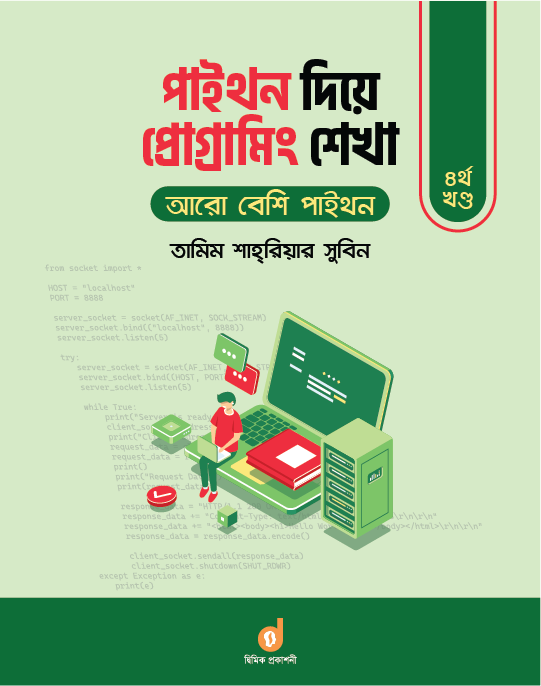

 

Learn Programming With Python : More Python
====================================

The writer of this book is **Tamim Shahriar Subeen**. This is the new book of 2022 and I read this line by line and documented it. Also I run all of code. Here my short documented of this book. 

Table of Content
----------------

- [Chapter 0 : Before Start](./chapter_00/chapter_00.md)

 

[< Go Back To README.md Fille](./../README.md)
----------------------------------------------